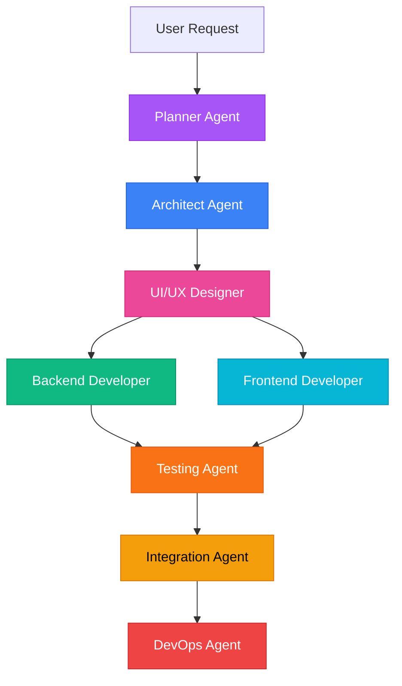

# Agent Color Scheme

Each agent has a distinct color for visual identification in documentation, diagrams, and UI elements.

## Color Palette

### 🔵 Architect Agent
**Primary Color**: Blue
- **Hex**: `#3B82F6`
- **RGB**: `rgb(59, 130, 246)`
- **Tailwind**: `bg-blue-500`
- **Semantic**: Authority, structure, foundation

### 🟣 Planner Agent
**Primary Color**: Purple
- **Hex**: `#A855F7`
- **RGB**: `rgb(168, 85, 247)`
- **Tailwind**: `bg-purple-500`
- **Semantic**: Strategy, organization, coordination

### 🟢 Backend Developer Agent
**Primary Color**: Green
- **Hex**: `#10B981`
- **RGB**: `rgb(16, 185, 129)`
- **Tailwind**: `bg-emerald-500`
- **Semantic**: Growth, technical foundation, server-side

### 🔵 Frontend Developer Agent
**Primary Color**: Cyan
- **Hex**: `#06B6D4`
- **RGB**: `rgb(6, 182, 212)`
- **Tailwind**: `bg-cyan-500`
- **Semantic**: Client-facing, visual, interactive

### 🌸 UI/UX Designer Agent
**Primary Color**: Pink
- **Hex**: `#EC4899`
- **RGB**: `rgb(236, 72, 153)`
- **Tailwind**: `bg-pink-500`
- **Semantic**: Creativity, aesthetics, user-centric

### 🟠 Testing Agent
**Primary Color**: Orange
- **Hex**: `#F97316`
- **RGB**: `rgb(249, 115, 22)`
- **Tailwind**: `bg-orange-500`
- **Semantic**: Quality, validation, caution

### 🟡 Integration Agent
**Primary Color**: Amber
- **Hex**: `#F59E0B`
- **RGB**: `rgb(245, 158, 11)`
- **Tailwind**: `bg-amber-500`
- **Semantic**: Connection, coordination, bridging

### 🔴 DevOps Agent
**Primary Color**: Red
- **Hex**: `#EF4444`
- **RGB**: `rgb(239, 68, 68)`
- **Tailwind**: `bg-red-500`
- **Semantic**: Infrastructure, deployment, production

## Usage Examples

### Markdown Badges

```markdown


```

### Mermaid Diagrams



### HTML/CSS

```html
<!-- Agent badges -->
<span class="agent-badge architect">Architect</span>
<span class="agent-badge planner">Planner</span>
<span class="agent-badge backend">Backend</span>
<span class="agent-badge frontend">Frontend</span>
<span class="agent-badge designer">UI/UX Designer</span>
<span class="agent-badge testing">Testing</span>
<span class="agent-badge integration">Integration</span>
<span class="agent-badge devops">DevOps</span>

<style>
.agent-badge {
  display: inline-block;
  padding: 4px 12px;
  border-radius: 6px;
  font-weight: 600;
  font-size: 14px;
  color: white;
}

.agent-badge.architect { background-color: #3B82F6; }
.agent-badge.planner { background-color: #A855F7; }
.agent-badge.backend { background-color: #10B981; }
.agent-badge.frontend { background-color: #06B6D4; }
.agent-badge.designer { background-color: #EC4899; }
.agent-badge.testing { background-color: #F97316; }
.agent-badge.integration { background-color: #F59E0B; color: #000; }
.agent-badge.devops { background-color: #EF4444; }
</style>
```

### React/TypeScript

```tsx
// Agent color constants
export const AGENT_COLORS = {
  ARCHITECT: '#3B82F6',
  PLANNER: '#A855F7',
  BACKEND: '#10B981',
  FRONTEND: '#06B6D4',
  DESIGNER: '#EC4899',
  TESTING: '#F97316',
  INTEGRATION: '#F59E0B',
  DEVOPS: '#EF4444',
} as const;

// Component
interface AgentBadgeProps {
  agent: keyof typeof AGENT_COLORS;
  children: React.ReactNode;
}

export function AgentBadge({ agent, children }: AgentBadgeProps) {
  return (
    <span
      className="inline-block px-3 py-1 rounded-md font-semibold text-sm text-white"
      style={{ backgroundColor: AGENT_COLORS[agent] }}
    >
      {children}
    </span>
  );
}
```

## Accessibility Considerations

### Color Blindness Compatibility

These colors were chosen to be distinguishable for common types of color blindness:

- **Deuteranopia/Protanopia** (red-green): Blue, purple, pink, and orange remain distinct
- **Tritanopia** (blue-yellow): Green, red, pink, and cyan remain distinct

### Contrast Ratios

All colors meet WCAG AA standards for contrast when used with white text:
- Blue (#3B82F6): 4.5:1
- Purple (#A855F7): 4.5:1
- Green (#10B981): 4.5:1
- Cyan (#06B6D4): 4.5:1
- Pink (#EC4899): 4.5:1
- Orange (#F97316): 4.5:1
- Amber (#F59E0B): Uses black text for better contrast
- Red (#EF4444): 4.5:1

### Alternative Identification

When color alone is not sufficient, use:
- Text labels
- Icons
- Patterns or textures
- Agent emoji prefixes (🔵 🟣 🟢 etc.)

## Color Scheme Export

### CSS Variables

```css
:root {
  --agent-architect: #3B82F6;
  --agent-planner: #A855F7;
  --agent-backend: #10B981;
  --agent-frontend: #06B6D4;
  --agent-designer: #EC4899;
  --agent-testing: #F97316;
  --agent-integration: #F59E0B;
  --agent-devops: #EF4444;
}
```

### JSON

```json
{
  "agents": {
    "architect": {
      "name": "Architect Agent",
      "color": "#3B82F6",
      "rgb": [59, 130, 246],
      "tailwind": "blue-500"
    },
    "planner": {
      "name": "Planner Agent",
      "color": "#A855F7",
      "rgb": [168, 85, 247],
      "tailwind": "purple-500"
    },
    "backend": {
      "name": "Backend Developer Agent",
      "color": "#10B981",
      "rgb": [16, 185, 129],
      "tailwind": "emerald-500"
    },
    "frontend": {
      "name": "Frontend Developer Agent",
      "color": "#06B6D4",
      "rgb": [6, 182, 212],
      "tailwind": "cyan-500"
    },
    "designer": {
      "name": "UI/UX Designer Agent",
      "color": "#EC4899",
      "rgb": [236, 72, 153],
      "tailwind": "pink-500"
    },
    "testing": {
      "name": "Testing Agent",
      "color": "#F97316",
      "rgb": [249, 115, 22],
      "tailwind": "orange-500"
    },
    "integration": {
      "name": "Integration Agent",
      "color": "#F59E0B",
      "rgb": [245, 158, 11],
      "tailwind": "amber-500"
    },
    "devops": {
      "name": "DevOps Agent",
      "color": "#EF4444",
      "rgb": [239, 68, 68],
      "tailwind": "red-500"
    }
  }
}
```

## Visual Reference

| Agent | Color | Hex | Preview |
|-------|-------|-----|---------|
| 🔵 Architect | Blue | #3B82F6 |  |
| 🟣 Planner | Purple | #A855F7 |  |
| 🟢 Backend | Green | #10B981 |  |
| 🔵 Frontend | Cyan | #06B6D4 |  |
| 🌸 UI/UX | Pink | #EC4899 |  |
| 🟠 Testing | Orange | #F97316 |  |
| 🟡 Integration | Amber | #F59E0B |  |
| 🔴 DevOps | Red | #EF4444 |  |

## Usage Guidelines

### When to Use Colors

✅ **DO use colors for:**
- Agent identification in diagrams
- Visual differentiation in documentation
- UI elements that represent agents
- Status indicators
- Workflow visualizations

❌ **DON'T use colors as:**
- The only way to convey information (add text labels)
- Semantic indicators without context
- Replacement for proper documentation

### Consistency

Always use the exact hex values specified above to maintain consistency across:
- Documentation
- Diagrams
- UI components
- Presentations
- Tools and dashboards
