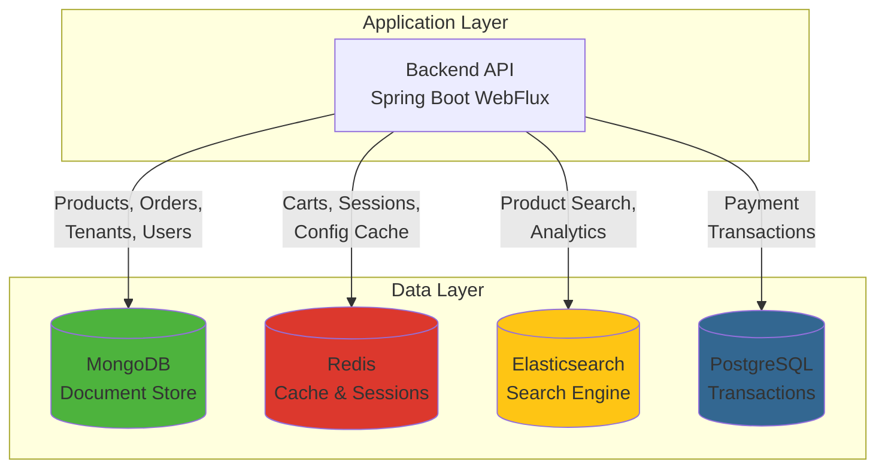
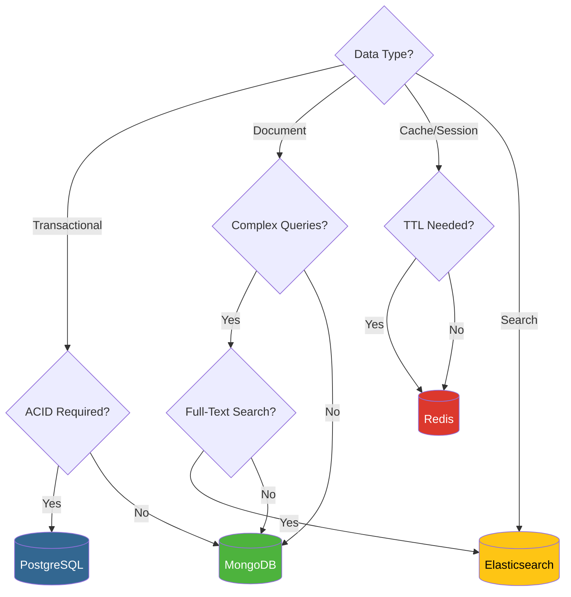
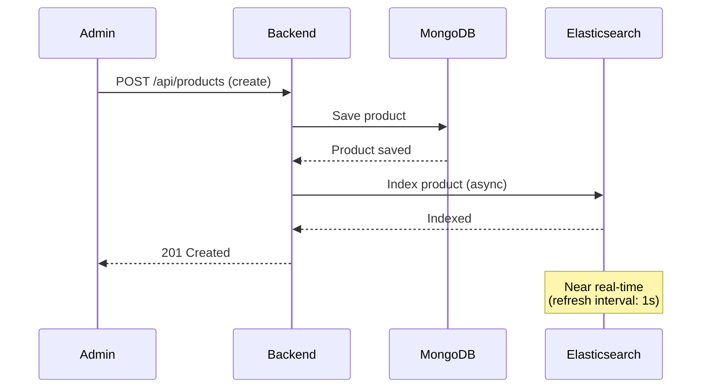
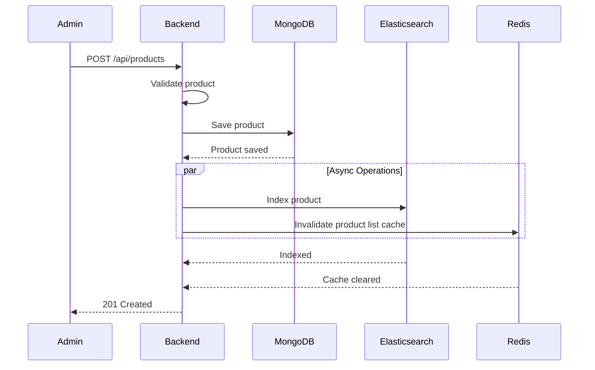
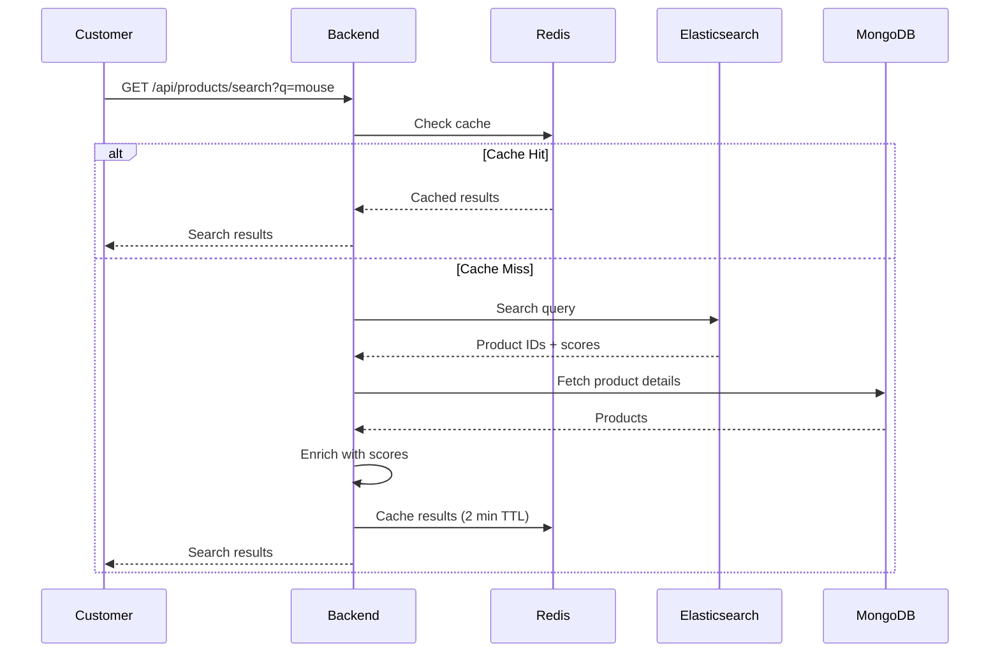
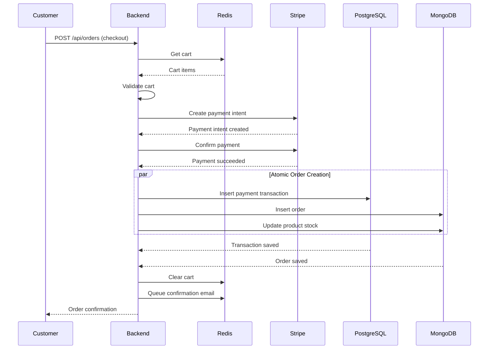

# Database Strategy - Polyglot Persistence

**Version**: 1.0
**Last Updated**: November 21, 2024
**Status**: Draft

---

## Table of Contents

1. [Overview](#overview)
2. [Database Selection Criteria](#database-selection-criteria)
3. [MongoDB - Document Store](#mongodb---document-store)
4. [Redis - Cache and Real-Time Data](#redis---cache-and-real-time-data)
5. [Elasticsearch - Search Engine](#elasticsearch---search-engine)
6. [PostgreSQL - Transactional Data](#postgresql---transactional-data)
7. [Data Flow Patterns](#data-flow-patterns)
8. [Migration Strategy](#migration-strategy)

---

## Overview

Retail Agentic employs a **polyglot persistence** strategy, using the right database for each use case. This approach optimizes for performance, scalability, and developer productivity.

### Database Responsibilities



### Database Comparison

| Use Case | Database | Rationale | Access Pattern |
|----------|----------|-----------|----------------|
| **Product Catalog** | MongoDB | Flexible schema, fast reads, nested documents | Spring Data Reactive MongoDB |
| **Orders** | MongoDB | Embedded line items, no joins needed | Spring Data Reactive MongoDB |
| **Tenants** | MongoDB | Configuration as JSON, infrequent updates | Spring Data Reactive MongoDB |
| **User Profiles** | MongoDB | Flexible attributes per tenant | Spring Data Reactive MongoDB |
| **Shopping Carts** | Redis | Ephemeral, high-speed access, TTL | Spring Data Redis Reactive |
| **Sessions** | Redis | Short-lived, distributed sessions | Spring Data Redis Reactive |
| **Config Cache** | Redis | Low-latency reads, automatic expiration | Spring Data Redis Reactive |
| **Product Search** | Elasticsearch | Full-text search, faceted filters | Spring Data Elasticsearch |
| **Analytics** | Elasticsearch | Aggregations, time-series data | Spring Data Elasticsearch |
| **Payment Transactions** | PostgreSQL | ACID compliance, financial data | R2DBC PostgreSQL |

---

## Database Selection Criteria

### Decision Tree



### When to Use Each Database

**MongoDB**:
- ✅ Flexible, evolving schemas
- ✅ Nested/embedded documents
- ✅ High read throughput
- ✅ Horizontal scaling (sharding)
- ❌ Complex multi-document transactions
- ❌ Complex joins

**Redis**:
- ✅ Millisecond latency required
- ✅ Ephemeral data (carts, sessions)
- ✅ Rate limiting, distributed locks
- ✅ Pub/sub messaging
- ❌ Complex queries
- ❌ Large datasets (memory-constrained)

**Elasticsearch**:
- ✅ Full-text search
- ✅ Faceted search (filters)
- ✅ Analytics and aggregations
- ✅ Log analysis
- ❌ Primary data store (eventual consistency)
- ❌ Strong transactional guarantees

**PostgreSQL**:
- ✅ ACID transactions required
- ✅ Financial data
- ✅ Strong consistency
- ✅ Complex joins and constraints
- ❌ Flexible schema needs
- ❌ Massive horizontal scaling

---

## MongoDB - Document Store

### Use Cases

1. **Product Catalog**
   - Flexible schema for dynamic attributes
   - Fast queries with proper indexing
   - Embedded images and metadata

2. **Orders**
   - Embedded line items (no joins)
   - Atomic order creation
   - Order status history as array

3. **Tenant Configuration**
   - Branding stored as nested JSON
   - Infrequent updates, frequent reads

4. **User Profiles**
   - Custom fields per tenant
   - Role-based access control

### Schema Design

#### Products Collection

```javascript
{
  "_id": ObjectId("..."),
  "tenantId": "uuid-123",
  "name": "Wireless Mouse",
  "sku": "MOUSE-001",
  "description": "Ergonomic wireless mouse...",
  "price": 29.99,
  "currency": "USD",
  "category": ["Electronics", "Accessories"],
  "images": [
    {
      "url": "https://cdn.../mouse-001.jpg",
      "alt": "Wireless mouse front view",
      "order": 0
    }
  ],
  "attributes": {
    "color": "Black",
    "connectivity": "Wireless",
    "brand": "TechBrand"
  },
  "stock": 150,
  "status": "active",
  "createdAt": ISODate("2024-11-21T10:00:00Z"),
  "updatedAt": ISODate("2024-11-21T10:00:00Z")
}
```

#### Orders Collection

```javascript
{
  "_id": ObjectId("..."),
  "tenantId": "uuid-123",
  "orderNumber": "ORD-2024-00123",
  "customer": {
    "email": "customer@example.com",
    "name": "John Doe"
  },
  "shippingAddress": {
    "line1": "123 Main St",
    "line2": "Apt 4",
    "city": "Springfield",
    "state": "IL",
    "postalCode": "62701",
    "country": "US"
  },
  "items": [
    {
      "productId": "product-uuid",
      "name": "Wireless Mouse",
      "sku": "MOUSE-001",
      "price": 29.99,
      "quantity": 2,
      "attributes": {
        "color": "Black"
      },
      "subtotal": 59.98
    }
  ],
  "pricing": {
    "subtotal": 59.98,
    "shipping": 5.00,
    "tax": 5.40,
    "total": 70.38
  },
  "payment": {
    "method": "card",
    "status": "paid",
    "transactionId": "stripe_xyz123"
  },
  "status": "pending",
  "statusHistory": [
    {
      "status": "pending",
      "timestamp": ISODate("2024-11-21T10:00:00Z"),
      "note": "Order placed"
    }
  ],
  "trackingNumber": null,
  "createdAt": ISODate("2024-11-21T10:00:00Z"),
  "updatedAt": ISODate("2024-11-21T10:00:00Z")
}
```

#### Tenants Collection

```javascript
{
  "_id": ObjectId("..."),
  "id": "uuid-123",
  "subdomain": "store1",
  "customDomain": "www.mystore.com",
  "name": "My Awesome Store",
  "description": "The best products online",
  "contactEmail": "support@mystore.com",
  "phone": "+1-555-123-4567",
  "branding": {
    "logoUrl": "https://cdn.../logo.png",
    "primaryColor": "#1E40AF",
    "secondaryColor": "#9333EA",
    "accentColor": "#F59E0B",
    "fontFamily": "Inter"
  },
  "settings": {
    "currency": "USD",
    "taxRate": 0.09,
    "freeShippingThreshold": 50.00,
    "lowStockThreshold": 10
  },
  "createdAt": ISODate("2024-11-21T10:00:00Z"),
  "updatedAt": ISODate("2024-11-21T10:00:00Z")
}
```

### Indexes

```javascript
// Products
db.products.createIndex({ tenantId: 1, status: 1 });
db.products.createIndex({ tenantId: 1, sku: 1 }, { unique: true });
db.products.createIndex({ tenantId: 1, category: 1 });
db.products.createIndex({ tenantId: 1, createdAt: -1 });
db.products.createIndex({ tenantId: 1, stock: 1 });

// Orders
db.orders.createIndex({ tenantId: 1, orderNumber: 1 }, { unique: true });
db.orders.createIndex({ tenantId: 1, "customer.email": 1 });
db.orders.createIndex({ tenantId: 1, status: 1, createdAt: -1 });
db.orders.createIndex({ tenantId: 1, createdAt: -1 });

// Tenants
db.tenants.createIndex({ subdomain: 1 }, { unique: true });
db.tenants.createIndex({ customDomain: 1 }, { unique: true, sparse: true });
db.tenants.createIndex({ id: 1 }, { unique: true });
```

### Spring Data MongoDB Configuration

```java
@Configuration
@EnableReactiveMongoRepositories(basePackages = "com.retailagentic.backend.infrastructure.persistence.mongo")
public class MongoConfig {

    @Bean
    public ReactiveMongoTemplate reactiveMongoTemplate(ReactiveMongoDatabaseFactory factory) {
        return new ReactiveMongoTemplate(factory);
    }

    @Bean
    public MongoCustomConversions customConversions() {
        return new MongoCustomConversions(Arrays.asList(
            new BigDecimalToDecimal128Converter(),
            new Decimal128ToBigDecimalConverter()
        ));
    }
}
```

**Repository Example**:
```java
public interface ProductRepository extends ReactiveMongoRepository<Product, String> {

    @Query("{ 'tenantId': ?0, 'status': 'active' }")
    Flux<Product> findActiveProducts(String tenantId, Pageable pageable);

    @Query("{ 'tenantId': ?0, 'sku': ?1 }")
    Mono<Product> findBySku(String tenantId, String sku);

    @Query("{ 'tenantId': ?0, 'stock': { $lte: ?1 } }")
    Flux<Product> findLowStockProducts(String tenantId, int threshold);
}
```

### Performance Optimization

**Read Performance**:
- Use projections to fetch only needed fields
- Implement pagination for large result sets
- Leverage covered queries (all fields in index)

**Write Performance**:
- Batch inserts for bulk operations
- Use unacknowledged writes for non-critical data (logs)
- Avoid large documents (>16MB limit)

**Scaling**:
- Vertical scaling for MVP (increase instance size)
- Horizontal scaling via sharding (shard key: `tenantId`)
- Read replicas for read-heavy workloads

---

## Redis - Cache and Real-Time Data

### Use Cases

1. **Shopping Carts**
   - High-speed read/write
   - 7-day TTL for cart expiration
   - Session-based access

2. **Sessions**
   - Distributed session management
   - 30-day TTL
   - Fast authentication checks

3. **Configuration Cache**
   - Cache tenant configuration
   - 5-minute TTL
   - Reduce MongoDB queries

4. **Rate Limiting**
   - Token bucket algorithm
   - Per-tenant rate limits
   - Automatic key expiration

### Key Design

**Pattern**: `{namespace}:{tenantId}:{identifier}`

**Examples**:
```
cart:tenant-123:session-abc           // Shopping cart
session:tenant-123:session-abc         // User session
config:tenant-123                      // Tenant config cache
ratelimit:tenant-123:/api/products     // Rate limit bucket
lock:inventory:product-456             // Distributed lock
```

### Data Structures

**Shopping Cart** (Hash):
```redis
HSET cart:tenant-123:session-abc
  item:product-1 '{"productId":"product-1","quantity":2,"price":29.99}'
  item:product-2 '{"productId":"product-2","quantity":1,"price":49.99}'
  subtotal 109.97
  tax 9.90
  shipping 5.00
  total 124.87
  updatedAt "2024-11-21T10:00:00Z"

EXPIRE cart:tenant-123:session-abc 604800  # 7 days
```

**Session** (String):
```redis
SET session:tenant-123:session-abc '{"userId":"user-1","role":"admin","tenantId":"tenant-123"}'
EXPIRE session:tenant-123:session-abc 2592000  # 30 days
```

**Config Cache** (String):
```redis
SET config:tenant-123 '{"name":"My Store","branding":{...}}'
EXPIRE config:tenant-123 300  # 5 minutes
```

**Rate Limit** (String with increment):
```redis
SET ratelimit:tenant-123:/api/products 0
EXPIRE ratelimit:tenant-123:/api/products 60
INCR ratelimit:tenant-123:/api/products
```

### Spring Data Redis Configuration

```java
@Configuration
@EnableRedisRepositories
public class RedisConfig {

    @Bean
    public ReactiveRedisTemplate<String, Object> reactiveRedisTemplate(
            ReactiveRedisConnectionFactory factory) {

        Jackson2JsonRedisSerializer<Object> serializer =
            new Jackson2JsonRedisSerializer<>(Object.class);

        RedisSerializationContext<String, Object> context =
            RedisSerializationContext.<String, Object>newSerializationContext()
                .key(StringRedisSerializer.UTF_8)
                .value(serializer)
                .hashKey(StringRedisSerializer.UTF_8)
                .hashValue(serializer)
                .build();

        return new ReactiveRedisTemplate<>(factory, context);
    }
}
```

**Service Example**:
```java
@Service
public class CartService {

    private final ReactiveRedisTemplate<String, Object> redisTemplate;
    private static final Duration CART_TTL = Duration.ofDays(7);

    public Mono<Cart> getCart(String sessionId) {
        return TenantContextHolder.getTenantId()
            .flatMap(tenantId -> {
                String key = buildCartKey(tenantId, sessionId);
                return redisTemplate.opsForHash()
                    .entries(key)
                    .collectMap(Map.Entry::getKey, Map.Entry::getValue)
                    .map(this::deserializeCart);
            });
    }

    public Mono<Cart> addItem(String sessionId, CartItem item) {
        return TenantContextHolder.getTenantId()
            .flatMap(tenantId -> {
                String key = buildCartKey(tenantId, sessionId);
                return redisTemplate.opsForHash()
                    .put(key, "item:" + item.getProductId(), item)
                    .then(redisTemplate.expire(key, CART_TTL))
                    .then(recalculateCart(key))
                    .then(getCart(sessionId));
            });
    }

    private String buildCartKey(String tenantId, String sessionId) {
        return String.format("cart:%s:%s", tenantId, sessionId);
    }
}
```

### Performance Optimization

**Connection Pooling**:
```yaml
spring:
  redis:
    lettuce:
      pool:
        max-active: 50
        max-idle: 20
        min-idle: 10
```

**Pipelining** (batch commands):
```java
public Mono<Void> updateMultipleItems(String cartKey, List<CartItem> items) {
    return redisTemplate.execute(connection ->
        Flux.fromIterable(items)
            .flatMap(item ->
                connection.hashCommands()
                    .hSet(ByteBuffer.wrap(cartKey.getBytes()),
                          ByteBuffer.wrap(item.getId().getBytes()),
                          ByteBuffer.wrap(serialize(item)))
            )
            .then()
    );
}
```

**Scaling**:
- Redis Cluster for horizontal scaling
- Redis Sentinel for high availability
- Read replicas for read-heavy workloads

---

## Elasticsearch - Search Engine

### Use Cases

1. **Product Search**
   - Full-text search across name, description, SKU
   - Fuzzy matching and typo tolerance
   - Relevance scoring

2. **Faceted Search**
   - Dynamic filters (category, color, size, price)
   - Aggregations with result counts
   - Multi-select filters

3. **Analytics** (Future)
   - Sales trends and reporting
   - Popular products
   - Search analytics

### Index Design

**Products Index** (`products-{tenantId}`):

```json
{
  "settings": {
    "number_of_shards": 3,
    "number_of_replicas": 1,
    "analysis": {
      "analyzer": {
        "product_analyzer": {
          "type": "custom",
          "tokenizer": "standard",
          "filter": ["lowercase", "asciifolding", "porter_stem"]
        },
        "autocomplete_analyzer": {
          "type": "custom",
          "tokenizer": "standard",
          "filter": ["lowercase", "edge_ngram"]
        }
      },
      "filter": {
        "edge_ngram": {
          "type": "edge_ngram",
          "min_gram": 2,
          "max_gram": 10
        }
      }
    }
  },
  "mappings": {
    "properties": {
      "tenantId": {
        "type": "keyword"
      },
      "name": {
        "type": "text",
        "analyzer": "product_analyzer",
        "fields": {
          "autocomplete": {
            "type": "text",
            "analyzer": "autocomplete_analyzer"
          },
          "keyword": {
            "type": "keyword"
          }
        }
      },
      "description": {
        "type": "text",
        "analyzer": "product_analyzer"
      },
      "sku": {
        "type": "keyword"
      },
      "price": {
        "type": "scaled_float",
        "scaling_factor": 100
      },
      "category": {
        "type": "keyword"
      },
      "attributes": {
        "type": "object",
        "dynamic": true
      },
      "stock": {
        "type": "integer"
      },
      "status": {
        "type": "keyword"
      },
      "createdAt": {
        "type": "date"
      }
    }
  }
}
```

### Query Examples

**Full-Text Search**:
```json
{
  "query": {
    "bool": {
      "must": [
        {
          "term": {
            "tenantId": "tenant-123"
          }
        },
        {
          "multi_match": {
            "query": "wireless mouse",
            "fields": ["name^3", "description", "sku"],
            "fuzziness": "AUTO"
          }
        }
      ],
      "filter": [
        {
          "term": {
            "status": "active"
          }
        }
      ]
    }
  },
  "sort": [
    { "_score": "desc" },
    { "createdAt": "desc" }
  ],
  "from": 0,
  "size": 20
}
```

**Faceted Search with Aggregations**:
```json
{
  "query": {
    "bool": {
      "must": [
        { "term": { "tenantId": "tenant-123" } },
        { "match": { "name": "mouse" } }
      ]
    }
  },
  "aggs": {
    "categories": {
      "terms": {
        "field": "category",
        "size": 20
      }
    },
    "price_ranges": {
      "range": {
        "field": "price",
        "ranges": [
          { "to": 25 },
          { "from": 25, "to": 50 },
          { "from": 50, "to": 100 },
          { "from": 100 }
        ]
      }
    },
    "attributes": {
      "nested": {
        "path": "attributes"
      },
      "aggs": {
        "color": {
          "terms": {
            "field": "attributes.color"
          }
        }
      }
    }
  }
}
```

### Spring Data Elasticsearch Configuration

```java
@Configuration
@EnableElasticsearchRepositories(basePackages = "com.retailagentic.backend.infrastructure.persistence.elasticsearch")
public class ElasticsearchConfig extends ElasticsearchConfiguration {

    @Override
    public ClientConfiguration clientConfiguration() {
        return ClientConfiguration.builder()
            .connectedTo("localhost:9200")
            .withConnectTimeout(Duration.ofSeconds(5))
            .withSocketTimeout(Duration.ofSeconds(30))
            .build();
    }
}
```

**Repository Example**:
```java
public interface ProductSearchRepository extends ElasticsearchRepository<ProductDocument, String> {

    @Query("{\n" +
           "  \"bool\": {\n" +
           "    \"must\": [\n" +
           "      { \"term\": { \"tenantId\": \"?0\" } },\n" +
           "      { \"multi_match\": { \"query\": \"?1\", \"fields\": [\"name^3\", \"description\"] } }\n" +
           "    ]\n" +
           "  }\n" +
           "}")
    Flux<ProductDocument> searchProducts(String tenantId, String query, Pageable pageable);
}
```

### Indexing Strategy

**Real-Time Indexing**:



**Bulk Re-indexing** (for schema changes):
```java
@Service
public class ReindexService {

    private final ProductRepository mongoRepository;
    private final ProductSearchRepository elasticsearchRepository;

    public Mono<Void> reindexAllProducts(String tenantId) {
        return mongoRepository
            .findByTenantId(tenantId)
            .buffer(100)  // Batch size
            .flatMap(products -> {
                List<ProductDocument> documents = products.stream()
                    .map(this::toDocument)
                    .collect(Collectors.toList());

                return elasticsearchRepository.saveAll(documents);
            })
            .then();
    }
}
```

### Performance Optimization

**Query Performance**:
- Use `bool` queries with filters (cacheable)
- Limit `size` parameter (max 1000)
- Use `scroll` API for deep pagination
- Optimize field mappings (disable indexing for unused fields)

**Scaling**:
- Add data nodes for increased capacity
- Shard by `tenantId` for tenant isolation
- Monitor shard size (keep under 50GB)

---

## PostgreSQL - Transactional Data

### Use Cases

1. **Payment Transactions**
   - ACID compliance required
   - Financial accuracy critical
   - Audit trail for compliance

### Schema Design

```sql
CREATE TABLE payment_transactions (
    id UUID PRIMARY KEY DEFAULT gen_random_uuid(),
    tenant_id UUID NOT NULL,
    order_id UUID NOT NULL,
    stripe_payment_intent_id VARCHAR(255) NOT NULL UNIQUE,
    amount DECIMAL(10, 2) NOT NULL,
    currency VARCHAR(3) NOT NULL DEFAULT 'USD',
    status VARCHAR(50) NOT NULL,
    failure_reason VARCHAR(500),
    created_at TIMESTAMP WITH TIME ZONE NOT NULL DEFAULT NOW(),
    updated_at TIMESTAMP WITH TIME ZONE NOT NULL DEFAULT NOW(),

    CONSTRAINT fk_tenant FOREIGN KEY (tenant_id) REFERENCES tenants(id)
);

CREATE INDEX idx_payment_transactions_tenant_id ON payment_transactions(tenant_id);
CREATE INDEX idx_payment_transactions_order_id ON payment_transactions(order_id);
CREATE INDEX idx_payment_transactions_status ON payment_transactions(status);
CREATE INDEX idx_payment_transactions_created_at ON payment_transactions(created_at DESC);
```

### R2DBC Configuration

```java
@Configuration
@EnableR2dbcRepositories
public class PostgresConfig {

    @Bean
    public ConnectionFactory connectionFactory() {
        return ConnectionFactories.get(ConnectionFactoryOptions.builder()
            .option(DRIVER, "postgresql")
            .option(HOST, "localhost")
            .option(PORT, 5432)
            .option(USER, "retail_user")
            .option(PASSWORD, "secure_password")
            .option(DATABASE, "retail_db")
            .build());
    }

    @Bean
    public R2dbcEntityTemplate r2dbcEntityTemplate(ConnectionFactory connectionFactory) {
        return new R2dbcEntityTemplate(connectionFactory);
    }
}
```

**Repository Example**:
```java
@Repository
public interface PaymentTransactionRepository extends ReactiveCrudRepository<PaymentTransaction, UUID> {

    @Query("SELECT * FROM payment_transactions WHERE tenant_id = :tenantId AND order_id = :orderId")
    Mono<PaymentTransaction> findByOrderId(UUID tenantId, UUID orderId);

    @Query("SELECT * FROM payment_transactions WHERE tenant_id = :tenantId AND status = 'pending'")
    Flux<PaymentTransaction> findPendingTransactions(UUID tenantId);
}
```

### Transaction Management

```java
@Service
public class PaymentService {

    private final R2dbcEntityTemplate template;

    @Transactional
    public Mono<PaymentTransaction> processPayment(Order order, String paymentIntentId) {
        return template
            .getDatabaseClient()
            .sql("INSERT INTO payment_transactions (tenant_id, order_id, stripe_payment_intent_id, amount, currency, status) " +
                 "VALUES (:tenantId, :orderId, :paymentIntentId, :amount, :currency, :status)")
            .bind("tenantId", order.getTenantId())
            .bind("orderId", order.getId())
            .bind("paymentIntentId", paymentIntentId)
            .bind("amount", order.getTotal())
            .bind("currency", "USD")
            .bind("status", "pending")
            .fetch()
            .rowsUpdated()
            .then(findByOrderId(order.getTenantId(), order.getId()));
    }
}
```

---

## Data Flow Patterns

### Write Path (Product Creation)



### Read Path (Product Search)



### Checkout Flow (Multi-Database Transaction)



---

## Migration Strategy

### Phase 1: MVP (Current)

- MongoDB for all document data
- Redis for caching and sessions
- Elasticsearch for search
- PostgreSQL for payments

### Phase 2: Optimization (3-6 months)

- MongoDB sharding by `tenantId`
- Redis Cluster for horizontal scaling
- Elasticsearch replica shards
- PostgreSQL read replicas

### Phase 3: Advanced (6-12 months)

- Consider TimescaleDB for time-series analytics
- Event sourcing for order history
- CQRS pattern for complex queries
- Data warehouse for business intelligence

---

## Related Documentation

- [System Architecture](./system-architecture.md) - Overall system design
- [Multi-Tenancy](./multi-tenancy.md) - Tenant isolation patterns
- [API Design](./api-design.md) - API patterns and conventions

---

**Document Status**: Draft
**Next Review Date**: TBD
**Approval Required From**: Lead Architect, Database Administrator

---

**Version History**:

| Version | Date | Author | Changes |
|---------|------|--------|---------|
| 1.0 | 2024-11-21 | Architect Agent | Initial database strategy document |
