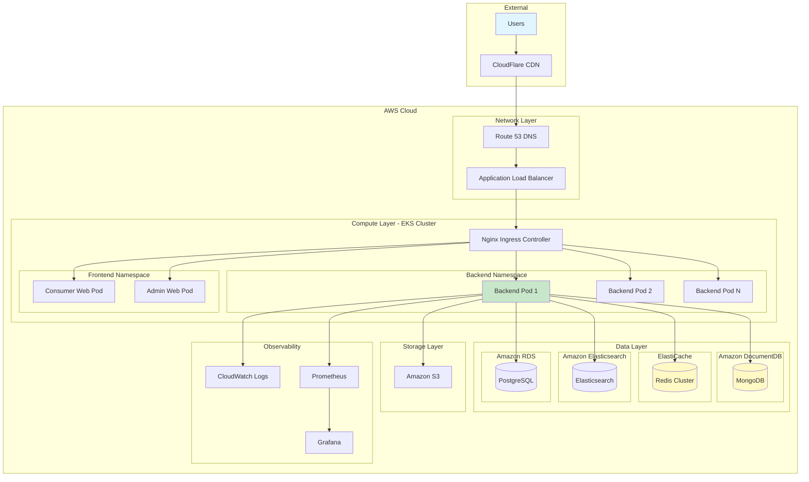
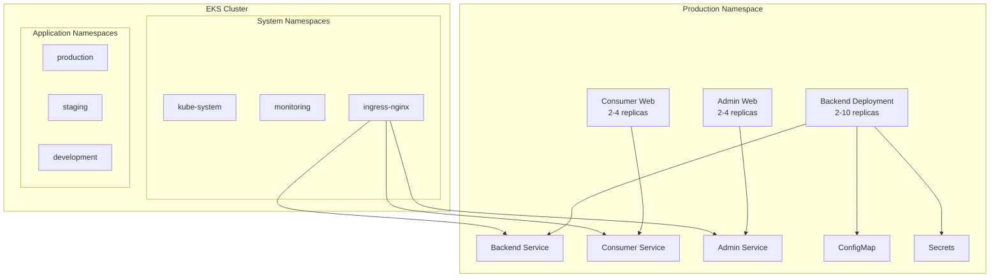
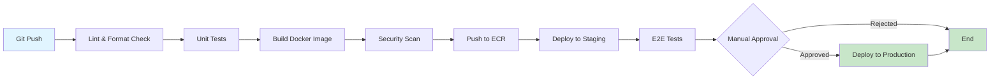
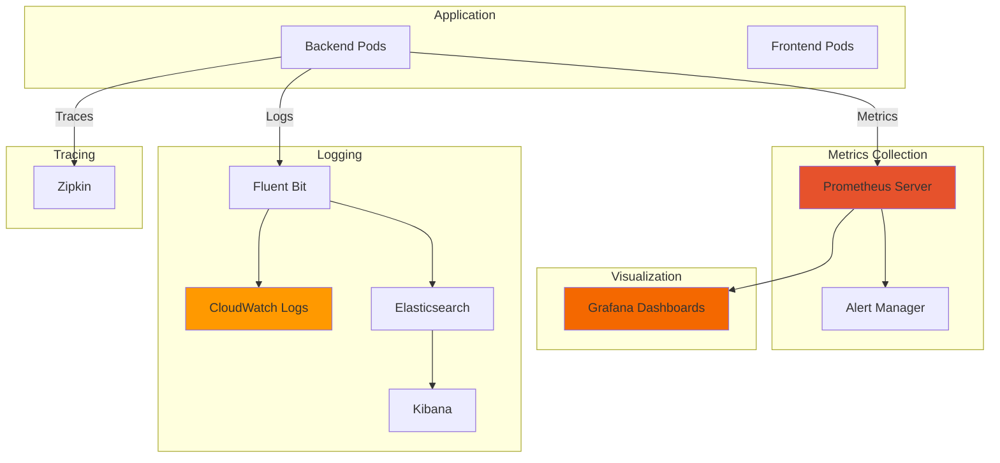

# Deployment Architecture

**Version**: 1.0
**Last Updated**: November 21, 2024
**Status**: Draft

---

## Table of Contents

1. [Overview](#overview)
2. [Infrastructure Architecture](#infrastructure-architecture)
3. [Container Strategy](#container-strategy)
4. [Kubernetes Deployment](#kubernetes-deployment)
5. [CI/CD Pipeline](#cicd-pipeline)
6. [Environment Strategy](#environment-strategy)
7. [Monitoring and Observability](#monitoring-and-observability)
8. [Disaster Recovery](#disaster-recovery)

---

## Overview

Retail Agentic uses a cloud-native deployment strategy with Docker containers orchestrated by Kubernetes. The architecture supports horizontal scaling, high availability, and automated deployments.

### Deployment Characteristics

| Aspect | Strategy | Rationale |
|--------|----------|-----------|
| **Containerization** | Docker | Consistent environments, easy portability |
| **Orchestration** | Kubernetes | Auto-scaling, self-healing, rolling updates |
| **CI/CD** | GitHub Actions | Integrated with repository, fast feedback |
| **Cloud Provider** | AWS (MVP) | Mature services, cost-effective |
| **Infrastructure as Code** | Terraform | Version-controlled infrastructure |
| **Configuration** | ConfigMaps + Secrets | Kubernetes-native, environment separation |

---

## Infrastructure Architecture

### High-Level Infrastructure



### Component Breakdown

| Component | Service | Purpose | Scaling Strategy |
|-----------|---------|---------|------------------|
| **DNS** | Route 53 | Domain routing, subdomain management | N/A (managed) |
| **CDN** | CloudFlare | Static asset delivery, DDoS protection | N/A (managed) |
| **Load Balancer** | ALB | Traffic distribution, SSL termination | Auto-scales |
| **Compute** | EKS (Kubernetes) | Container orchestration | Horizontal pod autoscaling |
| **Backend** | Docker containers | API services | 2-10 pods (auto-scale) |
| **Frontend** | Nginx + static files | Web applications | 2-4 pods |
| **MongoDB** | DocumentDB | Document storage | Vertical + read replicas |
| **Redis** | ElastiCache | Cache and sessions | Cluster mode (3+ nodes) |
| **Elasticsearch** | Amazon ES | Search and analytics | 3+ node cluster |
| **PostgreSQL** | RDS | Transactional data | Vertical + read replicas |
| **Object Storage** | S3 | Images and assets | N/A (unlimited) |
| **Monitoring** | CloudWatch + Prometheus | Metrics and logs | N/A (managed) |

---

## Container Strategy

### Docker Images

#### Backend Image

**Dockerfile**:
```dockerfile
# Multi-stage build
FROM maven:3.9-eclipse-temurin-21 AS build
WORKDIR /app

# Copy pom.xml and download dependencies (cached layer)
COPY pom.xml .
RUN mvn dependency:go-offline

# Copy source and build
COPY src ./src
RUN mvn clean package -DskipTests

# Runtime stage
FROM eclipse-temurin:21-jre-alpine
WORKDIR /app

# Create non-root user
RUN addgroup -S spring && adduser -S spring -G spring
USER spring:spring

# Copy JAR from build stage
COPY --from=build /app/target/*.jar app.jar

# Health check
HEALTHCHECK --interval=30s --timeout=3s --start-period=40s \
  CMD wget --no-verbose --tries=1 --spider http://localhost:8080/actuator/health || exit 1

# Expose port
EXPOSE 8080

# Run application
ENTRYPOINT ["java", \
  "-XX:+UseContainerSupport", \
  "-XX:MaxRAMPercentage=75.0", \
  "-Djava.security.egd=file:/dev/./urandom", \
  "-jar", "app.jar"]
```

**Build and Push**:
```bash
# Build image
docker build -t retail-agentic/backend:1.0.0 -f backend/Dockerfile backend/

# Tag for registry
docker tag retail-agentic/backend:1.0.0 123456789.dkr.ecr.us-east-1.amazonaws.com/retail-backend:1.0.0

# Push to registry
docker push 123456789.dkr.ecr.us-east-1.amazonaws.com/retail-backend:1.0.0
```

#### Frontend Images

**Consumer Web Dockerfile**:
```dockerfile
# Build stage
FROM node:20-alpine AS build
WORKDIR /app

# Install dependencies (cached layer)
COPY package.json package-lock.json ./
RUN npm ci

# Copy source and build
COPY . .
RUN npm run build

# Production stage
FROM nginx:alpine
WORKDIR /usr/share/nginx/html

# Remove default nginx content
RUN rm -rf ./*

# Copy built app from build stage
COPY --from=build /app/dist .

# Copy custom nginx config
COPY nginx.conf /etc/nginx/conf.d/default.conf

# Health check
HEALTHCHECK --interval=30s --timeout=3s \
  CMD wget --no-verbose --tries=1 --spider http://localhost:80/health || exit 1

EXPOSE 80

CMD ["nginx", "-g", "daemon off;"]
```

**Nginx Configuration**:
```nginx
server {
    listen 80;
    server_name _;

    root /usr/share/nginx/html;
    index index.html;

    # Gzip compression
    gzip on;
    gzip_types text/plain text/css application/json application/javascript text/xml application/xml application/xml+rss text/javascript;

    # Security headers
    add_header X-Frame-Options "SAMEORIGIN" always;
    add_header X-Content-Type-Options "nosniff" always;
    add_header X-XSS-Protection "1; mode=block" always;

    # SPA routing - serve index.html for all routes
    location / {
        try_files $uri $uri/ /index.html;
    }

    # Health check endpoint
    location /health {
        access_log off;
        return 200 "healthy\n";
        add_header Content-Type text/plain;
    }

    # Cache static assets
    location ~* \.(jpg|jpeg|png|gif|ico|css|js|svg|woff|woff2|ttf|eot)$ {
        expires 1y;
        add_header Cache-Control "public, immutable";
    }
}
```

### Image Versioning Strategy

**Semantic Versioning**: `{major}.{minor}.{patch}`

**Tags**:
- `latest` - Latest stable release
- `1.0.0` - Specific version
- `1.0.0-rc.1` - Release candidate
- `dev` - Development builds (from main branch)
- `pr-123` - Pull request builds

**Example**:
```
retail-backend:1.0.0
retail-backend:latest
retail-consumer-web:1.0.0
retail-admin-web:1.0.0
```

---

## Kubernetes Deployment

### Cluster Architecture



### Backend Deployment

**deployment.yaml**:
```yaml
apiVersion: apps/v1
kind: Deployment
metadata:
  name: backend
  namespace: production
  labels:
    app: backend
    version: v1
spec:
  replicas: 2
  strategy:
    type: RollingUpdate
    rollingUpdate:
      maxSurge: 1
      maxUnavailable: 0
  selector:
    matchLabels:
      app: backend
  template:
    metadata:
      labels:
        app: backend
        version: v1
    spec:
      serviceAccountName: backend-sa
      containers:
      - name: backend
        image: 123456789.dkr.ecr.us-east-1.amazonaws.com/retail-backend:1.0.0
        imagePullPolicy: IfNotPresent
        ports:
        - name: http
          containerPort: 8080
          protocol: TCP
        env:
        - name: SPRING_PROFILES_ACTIVE
          value: "production"
        - name: MONGODB_URI
          valueFrom:
            secretKeyRef:
              name: backend-secrets
              key: mongodb-uri
        - name: REDIS_HOST
          valueFrom:
            configMapKeyRef:
              name: backend-config
              key: redis-host
        - name: STRIPE_API_KEY
          valueFrom:
            secretKeyRef:
              name: backend-secrets
              key: stripe-api-key
        resources:
          requests:
            memory: "512Mi"
            cpu: "250m"
          limits:
            memory: "1Gi"
            cpu: "1000m"
        livenessProbe:
          httpGet:
            path: /actuator/health/liveness
            port: 8080
          initialDelaySeconds: 60
          periodSeconds: 10
          timeoutSeconds: 5
          failureThreshold: 3
        readinessProbe:
          httpGet:
            path: /actuator/health/readiness
            port: 8080
          initialDelaySeconds: 30
          periodSeconds: 5
          timeoutSeconds: 3
          failureThreshold: 3
        volumeMounts:
        - name: config
          mountPath: /app/config
          readOnly: true
      volumes:
      - name: config
        configMap:
          name: backend-config
---
apiVersion: v1
kind: Service
metadata:
  name: backend-service
  namespace: production
spec:
  type: ClusterIP
  selector:
    app: backend
  ports:
  - name: http
    port: 80
    targetPort: 8080
    protocol: TCP
---
apiVersion: autoscaling/v2
kind: HorizontalPodAutoscaler
metadata:
  name: backend-hpa
  namespace: production
spec:
  scaleTargetRef:
    apiVersion: apps/v1
    kind: Deployment
    name: backend
  minReplicas: 2
  maxReplicas: 10
  metrics:
  - type: Resource
    resource:
      name: cpu
      target:
        type: Utilization
        averageUtilization: 70
  - type: Resource
    resource:
      name: memory
      target:
        type: Utilization
        averageUtilization: 80
```

### ConfigMap and Secrets

**ConfigMap**:
```yaml
apiVersion: v1
kind: ConfigMap
metadata:
  name: backend-config
  namespace: production
data:
  application.yaml: |
    server:
      port: 8080
    spring:
      application:
        name: retail-backend
    app:
      tenant:
        strategy: subdomain
  redis-host: "redis-cluster.production.svc.cluster.local"
  elasticsearch-host: "elasticsearch.production.svc.cluster.local"
```

**Secrets** (base64 encoded):
```yaml
apiVersion: v1
kind: Secret
metadata:
  name: backend-secrets
  namespace: production
type: Opaque
data:
  mongodb-uri: bW9uZ29kYjovL3VzZXI6cGFzc3dvcmRAaG9zdDpwb3J0L2Ri  # base64 encoded
  stripe-api-key: c2tfbGl2ZV8uLi4=  # base64 encoded
  jwt-secret: c2VjcmV0a2V5MTIz  # base64 encoded
```

### Ingress Configuration

**ingress.yaml**:
```yaml
apiVersion: networking.k8s.io/v1
kind: Ingress
metadata:
  name: retail-ingress
  namespace: production
  annotations:
    nginx.ingress.kubernetes.io/rewrite-target: /
    nginx.ingress.kubernetes.io/ssl-redirect: "true"
    cert-manager.io/cluster-issuer: "letsencrypt-prod"
spec:
  ingressClassName: nginx
  tls:
  - hosts:
    - "*.retail-agentic.com"
    - "retail-agentic.com"
    secretName: retail-tls
  rules:
  # Wildcard subdomain for tenant stores
  - host: "*.retail-agentic.com"
    http:
      paths:
      - path: /api
        pathType: Prefix
        backend:
          service:
            name: backend-service
            port:
              number: 80
      - path: /
        pathType: Prefix
        backend:
          service:
            name: consumer-web-service
            port:
              number: 80

  # Admin portal
  - host: "admin.retail-agentic.com"
    http:
      paths:
      - path: /api
        pathType: Prefix
        backend:
          service:
            name: backend-service
            port:
              number: 80
      - path: /
        pathType: Prefix
        backend:
          service:
            name: admin-web-service
            port:
              number: 80
```

---

## CI/CD Pipeline

### GitHub Actions Workflow



### Backend CI/CD Pipeline

**.github/workflows/backend-ci-cd.yml**:
```yaml
name: Backend CI/CD

on:
  push:
    branches: [main, develop]
    paths:
      - 'backend/**'
  pull_request:
    branches: [main]
    paths:
      - 'backend/**'

env:
  AWS_REGION: us-east-1
  ECR_REPOSITORY: retail-backend
  EKS_CLUSTER: retail-cluster

jobs:
  lint-and-test:
    runs-on: ubuntu-latest
    steps:
      - name: Checkout code
        uses: actions/checkout@v4

      - name: Set up JDK 21
        uses: actions/setup-java@v4
        with:
          java-version: '21'
          distribution: 'temurin'
          cache: maven

      - name: Run linter
        run: cd backend && mvn checkstyle:check

      - name: Run unit tests
        run: cd backend && mvn test

      - name: Generate test coverage
        run: cd backend && mvn jacoco:report

      - name: Upload coverage to Codecov
        uses: codecov/codecov-action@v3
        with:
          files: ./backend/target/site/jacoco/jacoco.xml

  build-and-push:
    needs: lint-and-test
    if: github.event_name == 'push'
    runs-on: ubuntu-latest
    outputs:
      image-tag: ${{ steps.meta.outputs.tags }}
    steps:
      - name: Checkout code
        uses: actions/checkout@v4

      - name: Configure AWS credentials
        uses: aws-actions/configure-aws-credentials@v4
        with:
          aws-access-key-id: ${{ secrets.AWS_ACCESS_KEY_ID }}
          aws-secret-access-key: ${{ secrets.AWS_SECRET_ACCESS_KEY }}
          aws-region: ${{ env.AWS_REGION }}

      - name: Login to Amazon ECR
        id: login-ecr
        uses: aws-actions/amazon-ecr-login@v2

      - name: Extract metadata
        id: meta
        uses: docker/metadata-action@v5
        with:
          images: ${{ steps.login-ecr.outputs.registry }}/${{ env.ECR_REPOSITORY }}
          tags: |
            type=ref,event=branch
            type=sha,prefix={{branch}}-
            type=semver,pattern={{version}}

      - name: Build and push Docker image
        uses: docker/build-push-action@v5
        with:
          context: ./backend
          push: true
          tags: ${{ steps.meta.outputs.tags }}
          cache-from: type=gha
          cache-to: type=gha,mode=max

      - name: Scan image for vulnerabilities
        uses: aquasecurity/trivy-action@master
        with:
          image-ref: ${{ steps.meta.outputs.tags }}
          format: 'sarif'
          output: 'trivy-results.sarif'

      - name: Upload Trivy results to GitHub Security
        uses: github/codeql-action/upload-sarif@v2
        with:
          sarif_file: 'trivy-results.sarif'

  deploy-staging:
    needs: build-and-push
    if: github.ref == 'refs/heads/develop'
    runs-on: ubuntu-latest
    environment: staging
    steps:
      - name: Checkout code
        uses: actions/checkout@v4

      - name: Configure AWS credentials
        uses: aws-actions/configure-aws-credentials@v4
        with:
          aws-access-key-id: ${{ secrets.AWS_ACCESS_KEY_ID }}
          aws-secret-access-key: ${{ secrets.AWS_SECRET_ACCESS_KEY }}
          aws-region: ${{ env.AWS_REGION }}

      - name: Update kubeconfig
        run: |
          aws eks update-kubeconfig --name ${{ env.EKS_CLUSTER }} --region ${{ env.AWS_REGION }}

      - name: Deploy to staging
        run: |
          kubectl set image deployment/backend \
            backend=${{ needs.build-and-push.outputs.image-tag }} \
            -n staging

      - name: Wait for rollout
        run: |
          kubectl rollout status deployment/backend -n staging --timeout=5m

  e2e-tests:
    needs: deploy-staging
    runs-on: ubuntu-latest
    steps:
      - name: Checkout code
        uses: actions/checkout@v4

      - name: Run E2E tests
        run: |
          cd e2e-tests
          npm ci
          npm run test:staging

  deploy-production:
    needs: e2e-tests
    if: github.ref == 'refs/heads/main'
    runs-on: ubuntu-latest
    environment: production
    steps:
      - name: Checkout code
        uses: actions/checkout@v4

      - name: Configure AWS credentials
        uses: aws-actions/configure-aws-credentials@v4
        with:
          aws-access-key-id: ${{ secrets.AWS_ACCESS_KEY_ID }}
          aws-secret-access-key: ${{ secrets.AWS_SECRET_ACCESS_KEY }}
          aws-region: ${{ env.AWS_REGION }}

      - name: Update kubeconfig
        run: |
          aws eks update-kubeconfig --name ${{ env.EKS_CLUSTER }} --region ${{ env.AWS_REGION }}

      - name: Deploy to production
        run: |
          kubectl set image deployment/backend \
            backend=${{ needs.build-and-push.outputs.image-tag }} \
            -n production

      - name: Wait for rollout
        run: |
          kubectl rollout status deployment/backend -n production --timeout=10m

      - name: Smoke tests
        run: |
          curl -f https://api.retail-agentic.com/actuator/health || exit 1
```

---

## Environment Strategy

### Environment Tiers

| Environment | Purpose | Infrastructure | Data | Deployment Trigger |
|-------------|---------|----------------|------|-------------------|
| **Development** | Local development | Docker Compose | In-memory/mocks | Manual |
| **Staging** | Integration testing | EKS (1 node) | Staging database | Push to `develop` |
| **Production** | Live system | EKS (3+ nodes) | Production database | Push to `main` (with approval) |

### Configuration Management

**Environment Variables**:
```bash
# Development
SPRING_PROFILES_ACTIVE=dev
MONGODB_URI=mongodb://localhost:27017/retail_dev
REDIS_HOST=localhost

# Staging
SPRING_PROFILES_ACTIVE=staging
MONGODB_URI=mongodb://staging-cluster/retail_staging
REDIS_HOST=staging-redis.cache.amazonaws.com

# Production
SPRING_PROFILES_ACTIVE=production
MONGODB_URI=mongodb://prod-cluster/retail_production
REDIS_HOST=prod-redis.cache.amazonaws.com
```

---

## Monitoring and Observability

### Monitoring Stack



### Key Metrics

**Application Metrics**:
- Request rate (requests/second)
- Response time (p50, p95, p99)
- Error rate (%)
- Active connections
- JVM memory usage
- Database connection pool

**Business Metrics**:
- Orders per minute
- Revenue per hour
- Cart abandonment rate
- Search queries per second

**Infrastructure Metrics**:
- CPU utilization
- Memory utilization
- Network I/O
- Disk I/O
- Pod restart count

### Alerts

```yaml
# Prometheus Alert Rules
groups:
- name: backend-alerts
  rules:
  - alert: HighErrorRate
    expr: rate(http_server_requests_seconds_count{status=~"5.."}[5m]) > 0.05
    for: 5m
    labels:
      severity: critical
    annotations:
      summary: "High error rate detected"
      description: "Error rate is {{ $value }}% over the last 5 minutes"

  - alert: HighResponseTime
    expr: histogram_quantile(0.95, rate(http_server_requests_seconds_bucket[5m])) > 1
    for: 5m
    labels:
      severity: warning
    annotations:
      summary: "High response time"
      description: "95th percentile response time is {{ $value }}s"

  - alert: PodCrashLooping
    expr: rate(kube_pod_container_status_restarts_total[15m]) > 0
    for: 5m
    labels:
      severity: critical
    annotations:
      summary: "Pod is crash looping"
      description: "Pod {{ $labels.pod }} in namespace {{ $labels.namespace }} is restarting"
```

---

## Disaster Recovery

### Backup Strategy

| Component | Backup Method | Frequency | Retention | RPO | RTO |
|-----------|--------------|-----------|-----------|-----|-----|
| **MongoDB** | Automated snapshots | Daily | 30 days | 24 hours | 4 hours |
| **PostgreSQL** | Automated backups | Hourly | 7 days | 1 hour | 1 hour |
| **Redis** | RDB snapshots | Every 6 hours | 7 days | 6 hours | 30 minutes |
| **S3** | Versioning enabled | Continuous | 90 days | Minutes | Minutes |
| **Kubernetes Config** | Git repository | On change | Forever | Minutes | 30 minutes |

### Recovery Procedures

**Database Restore**:
```bash
# MongoDB restore from snapshot
aws docdb restore-db-cluster-from-snapshot \
  --db-cluster-identifier retail-cluster-restored \
  --snapshot-identifier retail-snapshot-2024-11-21

# PostgreSQL restore
aws rds restore-db-instance-from-db-snapshot \
  --db-instance-identifier retail-pg-restored \
  --db-snapshot-identifier retail-pg-snapshot-2024-11-21
```

**Kubernetes Disaster Recovery**:
```bash
# Restore from GitOps repository
kubectl apply -f k8s/production/

# Verify deployment
kubectl get all -n production
```

---

## Related Documentation

- [System Architecture](./system-architecture.md) - Overall system design
- [Multi-Tenancy](./multi-tenancy.md) - Tenant isolation patterns
- [Database Strategy](./database-strategy.md) - Data storage patterns

---

**Document Status**: Draft
**Next Review Date**: TBD
**Approval Required From**: DevOps Lead, Platform Architect

---

**Version History**:

| Version | Date | Author | Changes |
|---------|------|--------|---------|
| 1.0 | 2024-11-21 | Architect Agent | Initial deployment architecture |
