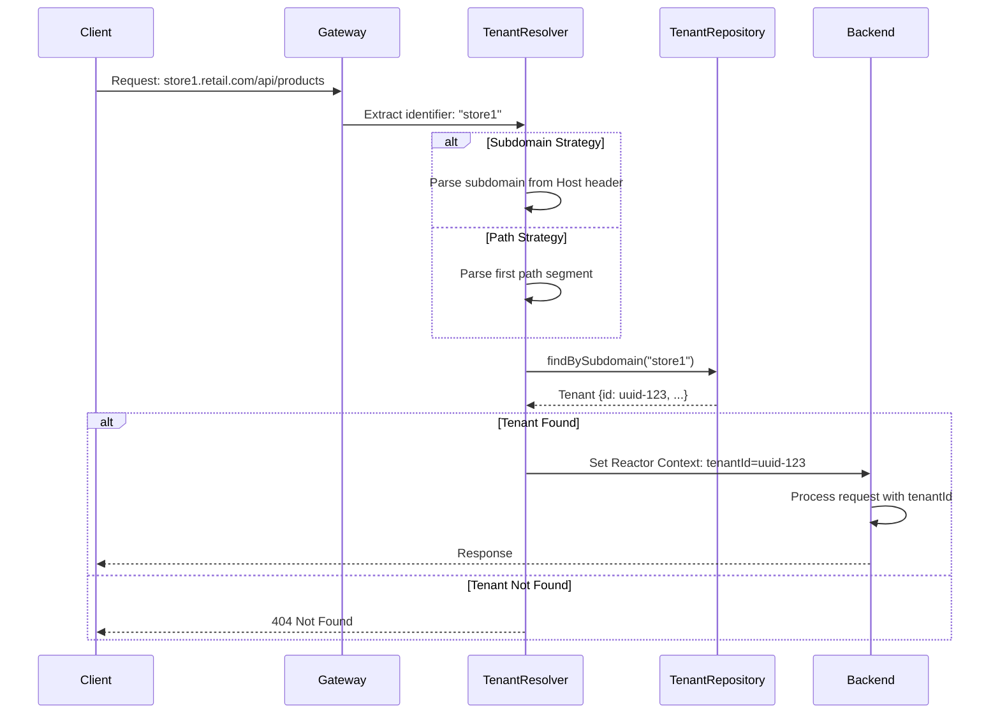
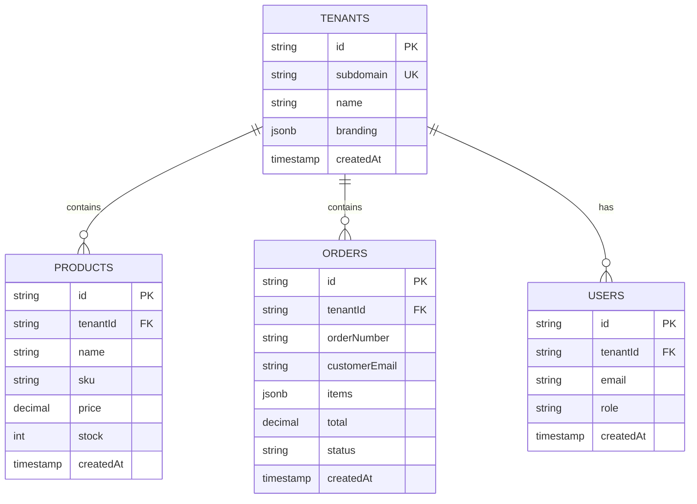
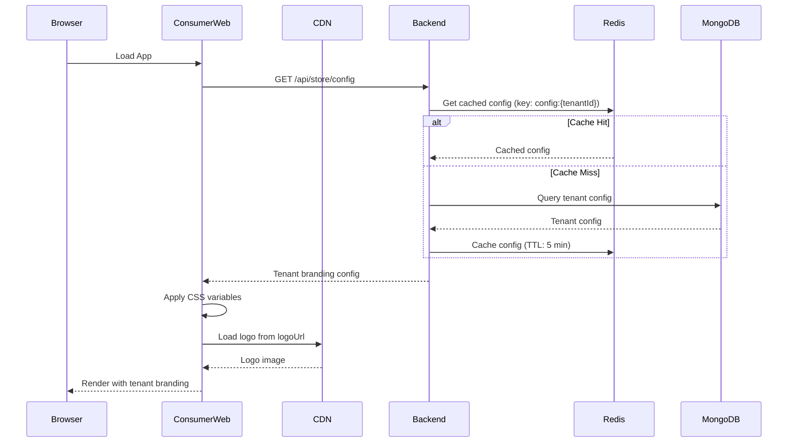
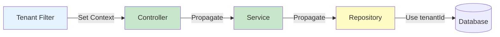

# Multi-Tenancy Architecture

**Version**: 1.0
**Last Updated**: November 21, 2024
**Status**: Draft

---

## Table of Contents

1. [Overview](#overview)
2. [Tenant Resolution](#tenant-resolution)
3. [Data Isolation](#data-isolation)
4. [Whitelabel Branding](#whitelabel-branding)
5. [Tenant Context Propagation](#tenant-context-propagation)
6. [Implementation Patterns](#implementation-patterns)
7. [Security Considerations](#security-considerations)
8. [Performance Optimization](#performance-optimization)

---

## Overview

Retail Agentic implements a **shared database, shared schema** multi-tenancy model with tenant discriminator columns. This approach provides:

- **Cost Efficiency**: Single infrastructure serves all tenants
- **Operational Simplicity**: Single codebase, unified maintenance
- **Scalability**: Easy tenant onboarding without infrastructure changes
- **Data Isolation**: Programmatic enforcement at application layer
- **Whitelabel Capability**: Per-tenant branding and domain

### Multi-Tenancy Characteristics

| Aspect | Implementation | Rationale |
|--------|---------------|-----------|
| **Database** | Shared | Cost-effective for MVP, sufficient isolation |
| **Schema** | Shared | Simpler schema management, easier upgrades |
| **Isolation** | Discriminator Column (`tenantId`) | Application-level enforcement |
| **Branding** | Per-tenant configuration | Whitelabel experience |
| **Domain** | Subdomain or path-based | Flexible tenant identification |
| **Scaling** | Horizontal (add app instances) | Stateless services |

---

## Tenant Resolution

### Resolution Strategies

Retail Agentic supports two tenant identification strategies:

#### Strategy 1: Subdomain-based

**URL Pattern**: `https://{tenant}.retail-agentic.com`

**Examples**:
- `https://store1.retail-agentic.com/api/products`
- `https://boutique.retail-agentic.com/checkout`

**Pros**:
- Clean separation
- Easy to understand
- SEO-friendly
- Cookie isolation

**Cons**:
- Requires wildcard SSL certificate
- DNS configuration per tenant

#### Strategy 2: Path-based

**URL Pattern**: `https://retail-agentic.com/{tenant}/...`

**Examples**:
- `https://retail-agentic.com/store1/api/products`
- `https://retail-agentic.com/boutique/checkout`

**Pros**:
- Single SSL certificate
- No DNS changes
- Simpler configuration

**Cons**:
- Less clean URLs
- Shared cookies (requires careful session management)

### Resolution Flow



### Implementation

**Tenant Resolver Filter**:
```java
@Component
@Order(Ordered.HIGHEST_PRECEDENCE)
public class TenantResolverFilter implements WebFilter {

    private final TenantRepository tenantRepository;
    private final TenantResolutionStrategy strategy;

    @Override
    public Mono<Void> filter(ServerWebExchange exchange, WebFilterChain chain) {
        return resolveTenantId(exchange)
            .flatMap(tenantId ->
                chain.filter(exchange)
                    .contextWrite(Context.of("tenantId", tenantId))
            )
            .switchIfEmpty(Mono.error(new TenantNotFoundException()));
    }

    private Mono<String> resolveTenantId(ServerWebExchange exchange) {
        String identifier = strategy.extractTenantIdentifier(exchange);

        return tenantRepository
            .findByIdentifier(identifier)
            .map(Tenant::getId)
            .cache(); // Cache for request duration
    }
}
```

**Subdomain Strategy**:
```java
@Component
@ConditionalOnProperty(name = "app.tenant.strategy", havingValue = "subdomain")
public class SubdomainTenantStrategy implements TenantResolutionStrategy {

    @Override
    public String extractTenantIdentifier(ServerWebExchange exchange) {
        String host = exchange.getRequest().getHeaders().getFirst("Host");

        if (host == null) {
            throw new InvalidTenantException("Host header missing");
        }

        // Extract subdomain: "store1.retail-agentic.com" -> "store1"
        String[] parts = host.split("\\.");

        if (parts.length < 3) {
            throw new InvalidTenantException("Invalid subdomain");
        }

        return parts[0];
    }
}
```

**Path Strategy**:
```java
@Component
@ConditionalOnProperty(name = "app.tenant.strategy", havingValue = "path")
public class PathTenantStrategy implements TenantResolutionStrategy {

    @Override
    public String extractTenantIdentifier(ServerWebExchange exchange) {
        String path = exchange.getRequest().getPath().value();

        // Extract from path: "/store1/api/products" -> "store1"
        String[] segments = path.split("/");

        if (segments.length < 2) {
            throw new InvalidTenantException("Tenant identifier missing in path");
        }

        return segments[1];
    }
}
```

---

## Data Isolation

### Discriminator Column Pattern

Every tenant-specific entity includes a `tenantId` field:

```java
@Document(collection = "products")
@Data
public class Product {
    @Id
    private String id;

    @Indexed
    @NotNull
    private String tenantId;  // Tenant discriminator

    private String name;
    private String sku;
    private BigDecimal price;
    // ... other fields
}
```

### Database Schema



### Automatic Tenant Filtering

**Aspect-Based Approach**:

```java
@Aspect
@Component
public class TenantFilterAspect {

    @Around("execution(* com.retailagentic.backend.infrastructure.persistence..*Repository.*(..))")
    public Object enforceTenantFilter(ProceedingJoinPoint joinPoint) throws Throwable {
        return Mono.deferContextual(ctx -> {
            try {
                String tenantId = ctx.get("tenantId");

                // Inject tenantId into query
                Object[] args = modifyArgsWithTenantId(joinPoint.getArgs(), tenantId);

                return (Mono<?>) joinPoint.proceed(args);
            } catch (Throwable e) {
                return Mono.error(e);
            }
        });
    }

    private Object[] modifyArgsWithTenantId(Object[] args, String tenantId) {
        // Logic to inject tenantId into query parameters
        // ...
        return args;
    }
}
```

**Repository Pattern with Tenant Filtering**:

```java
public interface TenantAwareRepository<T> {

    /**
     * Find all entities for current tenant
     */
    @TenantFiltered
    Flux<T> findAll();

    /**
     * Find entity by ID for current tenant
     */
    @TenantFiltered
    Mono<T> findById(String id);

    /**
     * Save entity (tenantId auto-injected)
     */
    @TenantFiltered
    Mono<T> save(T entity);

    /**
     * Delete entity for current tenant
     */
    @TenantFiltered
    Mono<Void> deleteById(String id);
}
```

**Implementation**:
```java
@Repository
public class ProductRepositoryImpl implements ProductRepository {

    private final ReactiveMongoTemplate mongoTemplate;

    @Override
    public Flux<Product> findAll() {
        return Mono.deferContextual(ctx -> {
            String tenantId = ctx.get("tenantId");

            Query query = Query.query(Criteria.where("tenantId").is(tenantId));
            return mongoTemplate.find(query, Product.class);
        }).flatMapMany(Function.identity());
    }

    @Override
    public Mono<Product> save(Product product) {
        return Mono.deferContextual(ctx -> {
            String tenantId = ctx.get("tenantId");

            // Auto-inject tenantId on save
            if (product.getTenantId() == null) {
                product.setTenantId(tenantId);
            } else if (!product.getTenantId().equals(tenantId)) {
                return Mono.error(new TenantMismatchException());
            }

            return mongoTemplate.save(product);
        });
    }
}
```

### Database Indexes

**Critical for Performance**:

```javascript
// MongoDB: Products collection
db.products.createIndex({ tenantId: 1, status: 1 });
db.products.createIndex({ tenantId: 1, sku: 1 }, { unique: true });
db.products.createIndex({ tenantId: 1, category: 1 });

// MongoDB: Orders collection
db.orders.createIndex({ tenantId: 1, orderNumber: 1 }, { unique: true });
db.orders.createIndex({ tenantId: 1, status: 1, createdAt: -1 });
db.orders.createIndex({ tenantId: 1, "customer.email": 1 });

// MongoDB: Tenants collection
db.tenants.createIndex({ subdomain: 1 }, { unique: true });
db.tenants.createIndex({ customDomain: 1 }, { unique: true, sparse: true });
```

**Redis: Key Prefixing**:
```
cart:{tenantId}:{sessionId}
config:{tenantId}
session:{tenantId}:{sessionId}
ratelimit:{tenantId}:{endpoint}
```

**Elasticsearch: Tenant Routing**:
```json
{
  "mappings": {
    "properties": {
      "tenantId": {
        "type": "keyword"
      }
    }
  },
  "settings": {
    "index": {
      "routing": {
        "allocation": {
          "include": {
            "_tier_preference": "data_hot"
          }
        }
      }
    }
  }
}
```

---

## Whitelabel Branding

### Tenant Configuration Model

```java
@Document(collection = "tenants")
@Data
public class Tenant {
    @Id
    private String id;

    // Identification
    private String subdomain;          // e.g., "store1"
    private String customDomain;       // e.g., "www.mystore.com"

    // Basic Info
    private String name;               // "My Awesome Store"
    private String description;
    private String contactEmail;
    private String phone;

    // Branding
    private Branding branding;

    // Settings
    private TenantSettings settings;

    private Instant createdAt;
    private Instant updatedAt;
}

@Data
public class Branding {
    private String logoUrl;            // CDN URL
    private String primaryColor;       // Hex: #1E40AF
    private String secondaryColor;     // Hex: #9333EA
    private String accentColor;        // Hex: #F59E0B
    private String fontFamily;         // "Inter", "Roboto", etc.
}

@Data
public class TenantSettings {
    private String currency;           // "USD"
    private BigDecimal taxRate;        // 0.09
    private BigDecimal freeShippingThreshold;  // 50.00
    private Integer lowStockThreshold; // 10
}
```

### Branding Application Flow



### Frontend Branding Implementation

**Loading Store Configuration**:
```typescript
// src/contexts/StoreConfigContext.tsx
interface StoreConfig {
  name: string;
  branding: {
    logoUrl: string;
    primaryColor: string;
    secondaryColor: string;
    accentColor: string;
    fontFamily: string;
  };
}

export function StoreConfigProvider({ children }: PropsWithChildren) {
  const { data: config, isLoading } = useQuery({
    queryKey: ['store-config'],
    queryFn: () => api.get<StoreConfig>('/api/store/config').then(res => res.data),
    staleTime: 5 * 60 * 1000, // 5 minutes
  });

  // Apply CSS variables when config loads
  useEffect(() => {
    if (config) {
      applyBranding(config.branding);
    }
  }, [config]);

  return (
    <StoreConfigContext.Provider value={{ config, isLoading }}>
      {children}
    </StoreConfigContext.Provider>
  );
}
```

**Applying Branding**:
```typescript
// src/utils/branding.ts
export function applyBranding(branding: Branding) {
  const root = document.documentElement;

  // Set CSS custom properties
  root.style.setProperty('--color-primary', branding.primaryColor);
  root.style.setProperty('--color-secondary', branding.secondaryColor);
  root.style.setProperty('--color-accent', branding.accentColor);
  root.style.setProperty('--font-family', branding.fontFamily);

  // Update document title
  document.title = `${config.name} - Shop Online`;

  // Update favicon (if provided)
  if (branding.faviconUrl) {
    const link = document.querySelector("link[rel*='icon']") as HTMLLinkElement;
    link.href = branding.faviconUrl;
  }
}
```

**Tailwind CSS Integration**:
```javascript
// tailwind.config.js
module.exports = {
  theme: {
    extend: {
      colors: {
        primary: 'var(--color-primary, #1E40AF)',
        secondary: 'var(--color-secondary, #9333EA)',
        accent: 'var(--color-accent, #F59E0B)',
      },
      fontFamily: {
        sans: ['var(--font-family, Inter)', 'system-ui', 'sans-serif'],
      },
    },
  },
};
```

---

## Tenant Context Propagation

### Reactor Context

Project Reactor provides `Context` for propagating request-scoped data through reactive chains.



**Setting Context in Filter**:
```java
@Override
public Mono<Void> filter(ServerWebExchange exchange, WebFilterChain chain) {
    return resolveTenantId(exchange)
        .flatMap(tenantId ->
            chain.filter(exchange)
                .contextWrite(Context.of("tenantId", tenantId))
        );
}
```

**Reading Context in Service**:
```java
@Service
public class ProductService {

    public Mono<Product> createProduct(Product product) {
        return Mono.deferContextual(ctx -> {
            String tenantId = ctx.get("tenantId");
            product.setTenantId(tenantId);

            return productRepository.save(product);
        });
    }

    public Flux<Product> searchProducts(String query) {
        return Mono.deferContextual(ctx -> {
            String tenantId = ctx.get("tenantId");

            return elasticsearchService
                .search(query, tenantId)
                .flatMapMany(productRepository::findByIds);
        }).flatMapMany(Function.identity());
    }
}
```

**Helper Utility**:
```java
@Component
public class TenantContextHolder {

    /**
     * Get current tenant ID from Reactor context
     */
    public static Mono<String> getTenantId() {
        return Mono.deferContextual(ctx ->
            Mono.justOrEmpty(ctx.getOrEmpty("tenantId"))
                .switchIfEmpty(Mono.error(new TenantContextMissingException()))
        );
    }

    /**
     * Execute operation with tenant context
     */
    public static <T> Mono<T> withTenant(Mono<T> operation) {
        return getTenantId()
            .flatMap(tenantId -> operation.contextWrite(Context.of("tenantId", tenantId)));
    }
}
```

---

## Implementation Patterns

### Pattern 1: Aspect-Oriented Tenant Filtering

**When to Use**: Automatic filtering for all repository operations

```java
@Aspect
@Component
public class TenantFilterAspect {

    @Around("@within(com.retailagentic.backend.infrastructure.persistence.TenantAware)")
    public Object applyTenantFilter(ProceedingJoinPoint joinPoint) throws Throwable {
        return Mono.deferContextual(ctx -> {
            String tenantId = ctx.get("tenantId");

            // Modify query to include tenantId
            Object[] args = Arrays.stream(joinPoint.getArgs())
                .map(arg -> {
                    if (arg instanceof Query) {
                        Query query = (Query) arg;
                        query.addCriteria(Criteria.where("tenantId").is(tenantId));
                    }
                    return arg;
                })
                .toArray();

            return (Mono<?>) joinPoint.proceed(args);
        });
    }
}
```

### Pattern 2: Custom Repository Base Class

**When to Use**: Consistent tenant filtering across all repositories

```java
@NoRepositoryBean
public interface TenantAwareRepository<T, ID> extends ReactiveCrudRepository<T, ID> {

    @Query("{ 'tenantId': ?#{@tenantContextHolder.getTenantId()}, '_id': ?0 }")
    @Override
    Mono<T> findById(ID id);

    @Query("{ 'tenantId': ?#{@tenantContextHolder.getTenantId()} }")
    @Override
    Flux<T> findAll();

    default Mono<T> saveWithTenant(T entity) {
        return TenantContextHolder.getTenantId()
            .flatMap(tenantId -> {
                if (entity instanceof TenantEntity) {
                    ((TenantEntity) entity).setTenantId(tenantId);
                }
                return save(entity);
            });
    }
}
```

### Pattern 3: Tenant-Specific Cache Keys

**When to Use**: Caching tenant-specific data in Redis

```java
@Service
public class CacheService {

    private final ReactiveRedisTemplate<String, Object> redisTemplate;

    public <T> Mono<T> getFromCache(String key, Class<T> type) {
        return TenantContextHolder.getTenantId()
            .flatMap(tenantId -> {
                String tenantKey = buildTenantKey(tenantId, key);
                return redisTemplate.opsForValue().get(tenantKey)
                    .cast(type);
            });
    }

    public Mono<Boolean> putInCache(String key, Object value, Duration ttl) {
        return TenantContextHolder.getTenantId()
            .flatMap(tenantId -> {
                String tenantKey = buildTenantKey(tenantId, key);
                return redisTemplate.opsForValue()
                    .set(tenantKey, value, ttl);
            });
    }

    private String buildTenantKey(String tenantId, String key) {
        return String.format("tenant:%s:%s", tenantId, key);
    }
}
```

---

## Security Considerations

### Threat Model

| Threat | Mitigation | Implementation |
|--------|-----------|----------------|
| **Cross-Tenant Data Access** | Enforce tenant filter on all queries | Aspect + Repository pattern |
| **Tenant Enumeration** | Rate limiting, obscure error messages | Generic 404 responses |
| **Subdomain Hijacking** | DNS validation, SSL certificate | Cloudflare protection |
| **Cache Poisoning** | Tenant-prefixed cache keys | Redis key prefixing |
| **Context Injection** | Immutable context, validation | Reactor Context immutability |
| **SQL/NoSQL Injection** | Parameterized queries | Spring Data parameterization |

### Security Checklist

- [ ] All database queries include `tenantId` filter
- [ ] Tenant context is immutable once set
- [ ] Redis keys include tenant prefix
- [ ] Elasticsearch queries include tenant routing
- [ ] Admin API validates tenant access (no cross-tenant admin access)
- [ ] Audit logging includes tenantId
- [ ] Unit tests verify tenant isolation
- [ ] Integration tests cover cross-tenant scenarios
- [ ] Performance tests measure overhead of tenant filtering

### Testing Tenant Isolation

```java
@SpringBootTest
@TestMethodOrder(MethodOrderer.OrderAnnotation.class)
class TenantIsolationTest {

    @Autowired
    private ProductRepository productRepository;

    private static final String TENANT_A = "tenant-a";
    private static final String TENANT_B = "tenant-b";

    @Test
    @Order(1)
    void createProductForTenantA() {
        Product product = new Product();
        product.setName("Product A");

        Mono<Product> result = productRepository.save(product)
            .contextWrite(Context.of("tenantId", TENANT_A));

        StepVerifier.create(result)
            .assertNext(p -> {
                assertThat(p.getTenantId()).isEqualTo(TENANT_A);
            })
            .verifyComplete();
    }

    @Test
    @Order(2)
    void tenantBCannotAccessTenantAData() {
        Flux<Product> result = productRepository.findAll()
            .contextWrite(Context.of("tenantId", TENANT_B));

        StepVerifier.create(result)
            .expectNextCount(0)  // Should find nothing
            .verifyComplete();
    }

    @Test
    @Order(3)
    void tenantACanAccessOwnData() {
        Flux<Product> result = productRepository.findAll()
            .contextWrite(Context.of("tenantId", TENANT_A));

        StepVerifier.create(result)
            .assertNext(p -> {
                assertThat(p.getName()).isEqualTo("Product A");
                assertThat(p.getTenantId()).isEqualTo(TENANT_A);
            })
            .verifyComplete();
    }
}
```

---

## Performance Optimization

### Caching Strategy

**Tenant Configuration**:
- Cache in Redis with 5-minute TTL
- Key: `config:{tenantId}`
- Invalidate on update

**Product Catalog**:
- Cache search results (2-minute TTL)
- Cache product details (10-minute TTL)
- Invalidate on product update

**Database Query Optimization**:
- Ensure all tenant-filtered queries use indexes
- Monitor query performance per tenant
- Identify slow queries with explain plans

### Monitoring Per-Tenant Metrics

```java
@Component
public class TenantMetrics {

    private final MeterRegistry meterRegistry;

    public void recordRequest(String tenantId, String endpoint, long durationMs) {
        Counter.builder("tenant.requests")
            .tag("tenantId", tenantId)
            .tag("endpoint", endpoint)
            .register(meterRegistry)
            .increment();

        Timer.builder("tenant.request.duration")
            .tag("tenantId", tenantId)
            .tag("endpoint", endpoint)
            .register(meterRegistry)
            .record(Duration.ofMillis(durationMs));
    }

    public void recordDatabaseQuery(String tenantId, String collection, long durationMs) {
        Timer.builder("tenant.database.query")
            .tag("tenantId", tenantId)
            .tag("collection", collection)
            .register(meterRegistry)
            .record(Duration.ofMillis(durationMs));
    }
}
```

**Grafana Dashboard Queries**:
```promql
# Request rate per tenant
rate(tenant_requests_total[5m])

# Average response time per tenant
rate(tenant_request_duration_sum[5m]) / rate(tenant_request_duration_count[5m])

# Database query time per tenant
histogram_quantile(0.95, rate(tenant_database_query_bucket[5m]))
```

---

## Related Documentation

- [System Architecture](./system-architecture.md) - Overall system design
- [Database Strategy](./database-strategy.md) - Data storage patterns
- [Security Architecture](./security.md) - Security implementation

---

**Document Status**: Draft
**Next Review Date**: TBD
**Approval Required From**: Lead Architect, Security Lead

---

**Version History**:

| Version | Date | Author | Changes |
|---------|------|--------|---------|
| 1.0 | 2024-11-21 | Architect Agent | Initial multi-tenancy architecture |
