# Retail Agentic - System Architecture

**Version**: 1.0
**Last Updated**: November 21, 2024
**Status**: Draft
**Owner**: Architecture Team

---

## Table of Contents

1. [Executive Summary](#executive-summary)
2. [Architectural Principles](#architectural-principles)
3. [System Overview](#system-overview)
4. [Architecture Layers](#architecture-layers)
5. [Component Architecture](#component-architecture)
6. [Data Flow](#data-flow)
7. [Technology Stack](#technology-stack)
8. [Scalability Strategy](#scalability-strategy)
9. [Security Architecture](#security-architecture)
10. [Performance Considerations](#performance-considerations)

---

## Executive Summary

Retail Agentic is built on a modern, cloud-native architecture designed for multi-tenancy, high performance, and horizontal scalability. The system uses reactive programming throughout, polyglot persistence for optimal data storage, and a microservices-ready monolithic approach for MVP simplicity.

### Key Architectural Characteristics

- **Multi-Tenant**: Single platform serving multiple independent stores with complete data isolation
- **Reactive**: Non-blocking I/O from HTTP layer to database using Project Reactor
- **Scalable**: Horizontal scaling via stateless services and Kubernetes orchestration
- **Polyglot Persistence**: Right database for each use case (MongoDB, Redis, Elasticsearch, PostgreSQL)
- **Cloud-Native**: Container-based deployment with modern DevOps practices
- **API-First**: RESTful APIs enable multiple frontend applications

---

## Architectural Principles

### 1. Multi-Tenancy First
Every architectural decision prioritizes tenant isolation and whitelabel capabilities:
- Data segregation at database level
- Tenant context propagated through all layers
- Zero cross-tenant data leakage tolerance
- Per-tenant customization (branding, domain, settings)

### 2. Reactive All The Way
Non-blocking, asynchronous processing throughout:
- Spring WebFlux for HTTP layer
- Reactive MongoDB, Redis, Elasticsearch drivers
- Project Reactor (Mono/Flux) for stream processing
- Backpressure handling for resource protection

### 3. Polyglot Persistence
Choose the right database for each use case:
- **MongoDB**: Document storage (products, orders, tenants)
- **Redis**: High-speed caching and ephemeral data (carts, sessions)
- **Elasticsearch**: Full-text search with complex queries
- **PostgreSQL**: ACID transactions (payments)

### 4. API-First Design
Backend exposes well-defined RESTful APIs:
- OpenAPI/Swagger documentation
- Versioned endpoints
- Consistent error handling
- Multiple frontend consumers

### 5. Independent Deployability
Each component can build, test, and run independently:
- Backend runs without frontend
- Frontend runs with mocked APIs
- Test isolation with in-memory databases
- Docker Compose for local full-stack

### 6. Security by Design
Security integrated at every layer:
- Tenant isolation enforced programmatically
- JWT authentication for admin APIs
- HTTPS-only communication
- Input validation and sanitization
- Rate limiting per tenant

### 7. Observability
Comprehensive monitoring and diagnostics:
- Structured JSON logging
- Application metrics (Micrometer)
- Distributed tracing (Spring Cloud Sleuth)
- Health checks and readiness probes

---

## System Overview

### High-Level Architecture

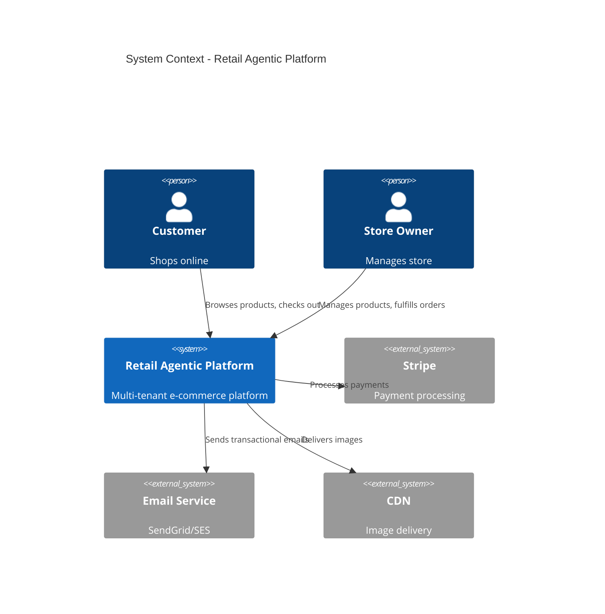

### Container Architecture

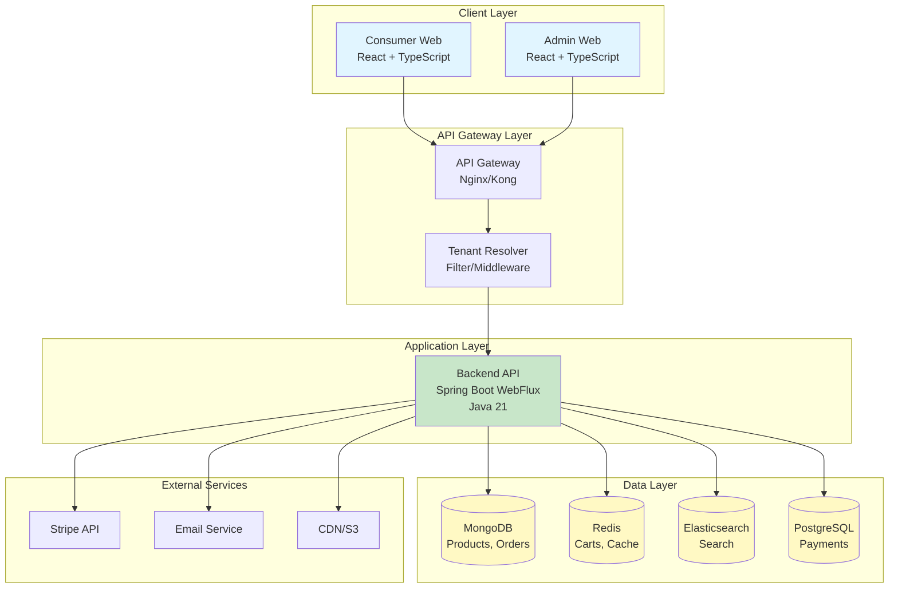

---

## Architecture Layers

### 1. Presentation Layer

**Consumer Web Application**
- **Technology**: React 18 + TypeScript + Vite
- **UI Framework**: Tailwind CSS + shadcn/ui
- **State Management**: React Context API + TanStack Query
- **Routing**: React Router v6
- **Responsibilities**:
  - Product browsing and search UI
  - Shopping cart management
  - Guest checkout flow
  - Order tracking
  - Responsive, accessible design

**Admin Web Application**
- **Technology**: React 18 + TypeScript + Vite
- **UI Framework**: Tailwind CSS + shadcn/ui
- **State Management**: React Context API + TanStack Query
- **Routing**: React Router v6
- **Responsibilities**:
  - Store configuration and branding
  - Product CRUD operations
  - Order management and fulfillment
  - Dashboard and analytics
  - Admin authentication

### 2. API Gateway Layer

**Responsibilities**:
- Request routing
- Tenant resolution (subdomain or path)
- Rate limiting
- SSL termination
- Load balancing
- CORS handling

**Technology Options**:
- **MVP**: Nginx as reverse proxy
- **Future**: Kong or AWS API Gateway for advanced features

**Tenant Resolution Flow**:

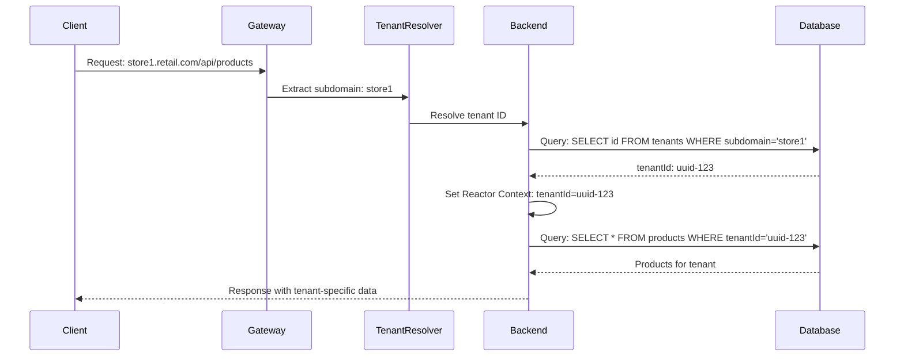

### 3. Application Layer

**Backend API**
- **Technology**: Spring Boot 3.2+ with WebFlux
- **Language**: Java 21 (latest LTS)
- **Build Tool**: Maven
- **Architecture Style**: Modular monolith (microservices-ready)

**Package Structure**:
```
com.retailagentic.backend/
├── api/                    # REST controllers
│   ├── product/
│   ├── cart/
│   ├── order/
│   └── store/
├── domain/                 # Business logic
│   ├── product/
│   ├── cart/
│   ├── order/
│   └── tenant/
├── infrastructure/         # External integrations
│   ├── persistence/        # Database repositories
│   ├── search/             # Elasticsearch
│   ├── payment/            # Stripe
│   ├── email/              # SendGrid/SES
│   └── storage/            # S3/CDN
├── security/               # Authentication & authorization
│   ├── jwt/
│   └── tenant/             # Tenant context filter
└── common/                 # Shared utilities
    ├── config/
    ├── exception/
    └── util/
```

**Key Design Patterns**:
- **Hexagonal Architecture**: Clear separation of domain, application, and infrastructure
- **Repository Pattern**: Data access abstraction
- **Factory Pattern**: Tenant-specific configuration
- **Strategy Pattern**: Multiple payment/shipping providers
- **Aspect-Oriented Programming**: Cross-cutting concerns (logging, tenant filtering)

### 4. Data Layer

**MongoDB** - Primary Document Store
- **Use Cases**: Products, Orders, Tenants, User Profiles
- **Access Pattern**: Spring Data Reactive MongoDB
- **Key Features**:
  - Flexible schema for dynamic product attributes
  - Atomic operations for order creation
  - Horizontal scaling via sharding (future)

**Redis** - Cache and Ephemeral Data
- **Use Cases**: Shopping carts, sessions, config cache, rate limiting
- **Access Pattern**: Spring Data Redis Reactive
- **Key Features**:
  - Sub-millisecond latency
  - TTL-based expiration
  - Pub/sub for real-time updates (future)

**Elasticsearch** - Search Engine
- **Use Cases**: Product search, analytics aggregations
- **Access Pattern**: Spring Data Elasticsearch
- **Key Features**:
  - Full-text search with relevance scoring
  - Faceted search (filters with counts)
  - Near real-time indexing

**PostgreSQL** - Transactional Data
- **Use Cases**: Payment transactions
- **Access Pattern**: R2DBC (reactive PostgreSQL driver)
- **Key Features**:
  - ACID compliance
  - Strong consistency
  - Audit trail

---

## Component Architecture

### Backend Component Diagram

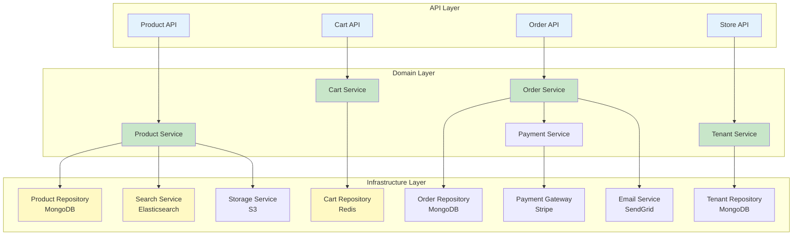

### Reactive Pipeline Example

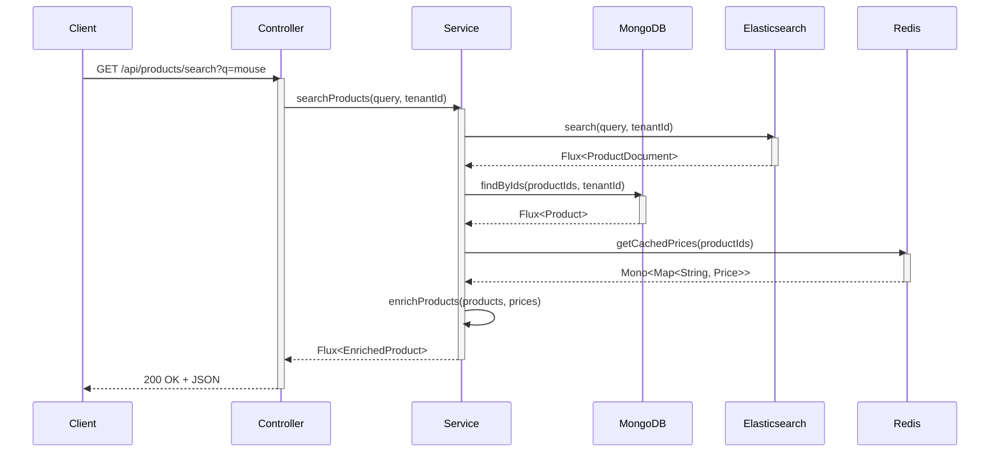

---

## Data Flow

### Customer Purchase Flow

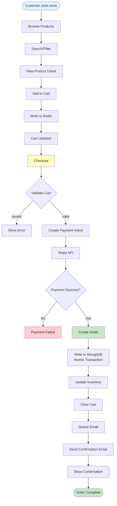

### Product Search Data Flow

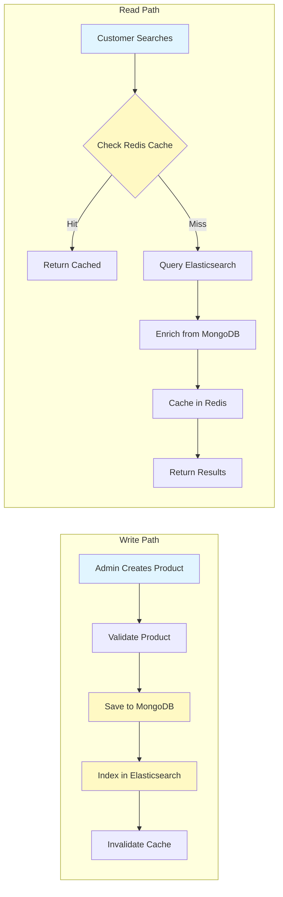

---

## Technology Stack

### Backend Stack

| Component | Technology | Version | Rationale |
|-----------|-----------|---------|-----------|
| **Runtime** | Java | 21 (LTS) | Latest LTS with virtual threads, performance improvements |
| **Framework** | Spring Boot | 3.2+ | Mature ecosystem, excellent WebFlux support |
| **Reactive** | Project Reactor | 3.6+ | Industry-standard reactive library, Spring integration |
| **Build** | Maven | 3.9+ | Dependency management, standardized lifecycle |
| **Testing** | JUnit 5 + Mockito | Latest | Unit testing with reactor support (StepVerifier) |
| **API Docs** | SpringDoc OpenAPI | 2.3+ | Automatic OpenAPI/Swagger generation |
| **Validation** | Jakarta Validation | 3.0+ | Bean validation (JSR-380) |
| **Logging** | Logback + SLF4J | Latest | Structured JSON logging |

### Frontend Stack

| Component | Technology | Version | Rationale |
|-----------|-----------|---------|-----------|
| **Runtime** | Node.js | 20 (LTS) | Latest LTS, native ESM support |
| **Framework** | React | 18+ | Component-based, excellent TypeScript support |
| **Language** | TypeScript | 5.3+ | Type safety, better DX |
| **Build Tool** | Vite | 5+ | Fast builds, HMR, native ESM |
| **Styling** | Tailwind CSS | 3.4+ | Utility-first, consistent design |
| **Components** | shadcn/ui | Latest | Accessible, customizable components |
| **Routing** | React Router | 6+ | Declarative routing, nested routes |
| **State** | TanStack Query | 5+ | Server state management, caching |
| **Forms** | React Hook Form | 7+ | Performant form validation |
| **HTTP Client** | Axios | 1.6+ | Request/response interceptors, TypeScript support |
| **Testing** | Vitest + Testing Library | Latest | Fast unit tests, React component testing |

### Database Stack

| Database | Version | Use Case | Driver |
|----------|---------|----------|--------|
| **MongoDB** | 7.0+ | Products, Orders, Tenants | Spring Data Reactive MongoDB |
| **Redis** | 7.2+ | Carts, Cache, Sessions | Spring Data Redis Reactive |
| **Elasticsearch** | 8.11+ | Product Search | Spring Data Elasticsearch |
| **PostgreSQL** | 15+ | Payment Transactions | R2DBC PostgreSQL |

### Infrastructure Stack

| Component | Technology | Rationale |
|-----------|-----------|-----------|
| **Container Runtime** | Docker | Standardized packaging |
| **Orchestration** | Kubernetes | Horizontal scaling, self-healing |
| **Service Mesh** | Istio (Future) | Traffic management, observability |
| **CI/CD** | GitHub Actions | Integrated with repository |
| **Container Registry** | Docker Hub / ECR | Image storage |
| **Secrets** | AWS Secrets Manager | Secure credential storage |
| **Monitoring** | Prometheus + Grafana | Metrics collection and visualization |
| **Logging** | ELK Stack / CloudWatch | Centralized logging |
| **Tracing** | Zipkin | Distributed tracing |
| **CDN** | Cloudflare / CloudFront | Global content delivery |
| **Object Storage** | AWS S3 | Image and asset storage |

---

## Scalability Strategy

### Horizontal Scaling

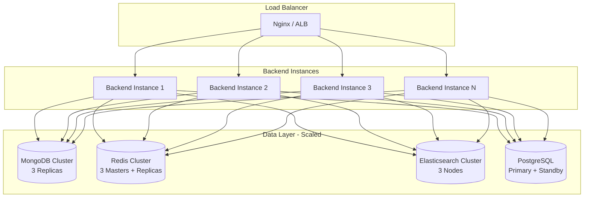

### Scaling Characteristics

| Component | Scaling Strategy | Bottleneck | Mitigation |
|-----------|-----------------|------------|------------|
| **Backend API** | Horizontal (stateless) | CPU for JSON serialization | Add more pods, optimize serialization |
| **MongoDB** | Vertical initially, then sharding | Write throughput | Shard by tenantId |
| **Redis** | Horizontal (cluster mode) | Memory | Add nodes, eviction policies |
| **Elasticsearch** | Horizontal (add nodes) | Search throughput | Add data nodes, optimize queries |
| **PostgreSQL** | Vertical + read replicas | Write throughput | Optimize transactions, batch writes |

### Performance Targets

| Metric | Target | Scaling Trigger |
|--------|--------|-----------------|
| **API Response Time (p95)** | <500ms | Add backend pods if >500ms |
| **Database Query Time (p95)** | <100ms | Optimize queries, add indexes |
| **Cache Hit Rate** | >80% | Tune TTL, increase memory |
| **Concurrent Users** | 100 per tenant | Auto-scale at 70% CPU |
| **Throughput** | 1000 req/sec | Add backend pods |

---

## Security Architecture

### Security Layers

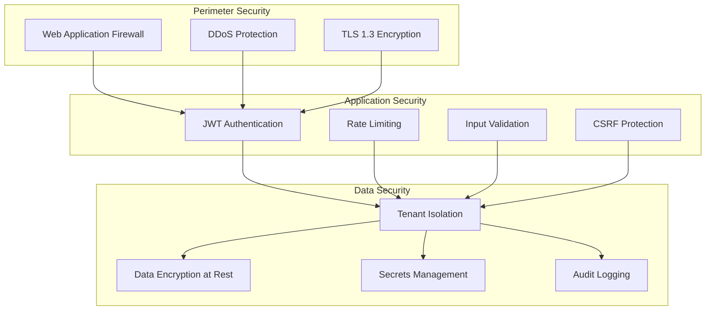

### Authentication Flow (Admin)

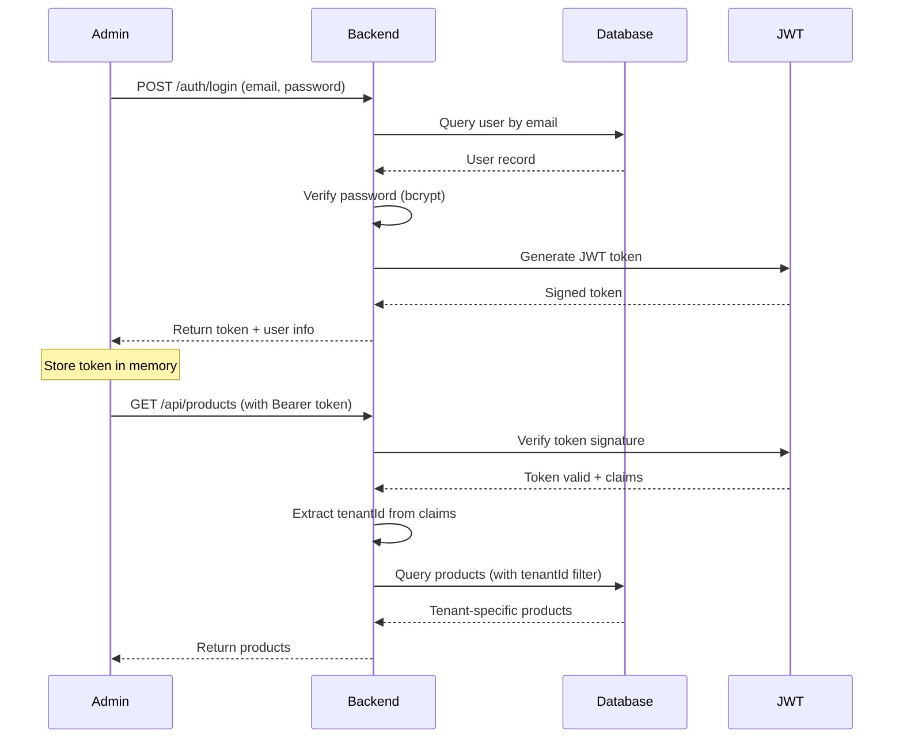

### Tenant Isolation Enforcement

```java
// Aspect for automatic tenant filtering
@Aspect
@Component
public class TenantFilterAspect {

    @Around("@annotation(com.retailagentic.security.tenant.TenantFiltered)")
    public Object enforceTenantFilter(ProceedingJoinPoint joinPoint) {
        return Mono.deferContextual(ctx -> {
            String tenantId = ctx.get("tenantId");

            // Inject tenantId into query
            Object[] args = joinPoint.getArgs();
            injectTenantId(args, tenantId);

            return ((Mono<?>) joinPoint.proceed(args))
                .contextWrite(Context.of("tenantId", tenantId));
        });
    }
}

// Usage in repository
@TenantFiltered
public Flux<Product> findAll() {
    // tenantId automatically injected
    return productRepository.findAll();
}
```

### Security Checklist

- [ ] HTTPS-only (TLS 1.3)
- [ ] JWT with RS256 signing
- [ ] Password hashing with bcrypt (cost factor: 12)
- [ ] Input validation on all endpoints (Jakarta Validation)
- [ ] Output encoding to prevent XSS
- [ ] Parameterized queries to prevent SQL injection
- [ ] CSRF tokens for state-changing operations
- [ ] Rate limiting per tenant (Redis-based)
- [ ] Tenant isolation enforced at query level
- [ ] Secrets in environment variables / AWS Secrets Manager
- [ ] Audit logging for sensitive operations
- [ ] Regular dependency scanning (Dependabot)
- [ ] OWASP Top 10 compliance

---

## Performance Considerations

### Caching Strategy

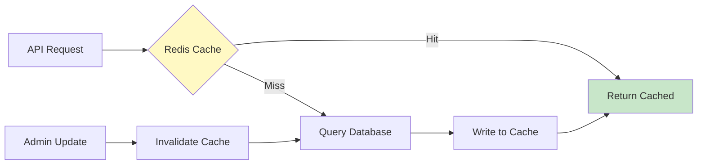

**Cache Strategy**:
- **Product List**: 5-minute TTL, invalidate on product update
- **Product Detail**: 10-minute TTL, invalidate on product update
- **Store Config**: 5-minute TTL, invalidate on config update
- **Search Results**: 2-minute TTL, invalidate on product changes
- **Cart**: Session-based, 7-day TTL

### Database Optimization

**MongoDB Indexes**:
```javascript
// Products collection
db.products.createIndex({ tenantId: 1, status: 1 });
db.products.createIndex({ tenantId: 1, sku: 1 }, { unique: true });
db.products.createIndex({ tenantId: 1, category: 1 });
db.products.createIndex({ tenantId: 1, createdAt: -1 });

// Orders collection
db.orders.createIndex({ tenantId: 1, orderNumber: 1 }, { unique: true });
db.orders.createIndex({ tenantId: 1, "customer.email": 1 });
db.orders.createIndex({ tenantId: 1, status: 1, createdAt: -1 });
```

**Query Optimization**:
- Use projections to fetch only needed fields
- Limit query results with pagination
- Use covered queries (all fields in index)
- Avoid regex queries in favor of Elasticsearch

### Reactive Backpressure

```java
// Example: Handle large result sets with backpressure
public Flux<Product> findAllProducts(String tenantId) {
    return productRepository
        .findByTenantId(tenantId)
        .buffer(100)  // Batch processing
        .flatMap(batch ->
            enrichProducts(batch)  // Enrich in batches
                .subscribeOn(Schedulers.parallel())
        )
        .onBackpressureBuffer(1000);  // Buffer up to 1000 items
}
```

---

## Related Documentation

- [Multi-Tenancy Architecture](./multi-tenancy.md) - Detailed tenant isolation patterns
- [Database Strategy](./database-strategy.md) - Polyglot persistence details
- [API Design](./api-design.md) - RESTful conventions and reactive patterns
- [Deployment Architecture](./deployment.md) - Infrastructure and DevOps

---

**Document Status**: Draft
**Next Review Date**: TBD
**Approval Required From**: CTO, Lead Architect, Backend Lead

---

**Version History**:

| Version | Date | Author | Changes |
|---------|------|--------|---------|
| 1.0 | 2024-11-21 | Architect Agent | Initial system architecture document |
