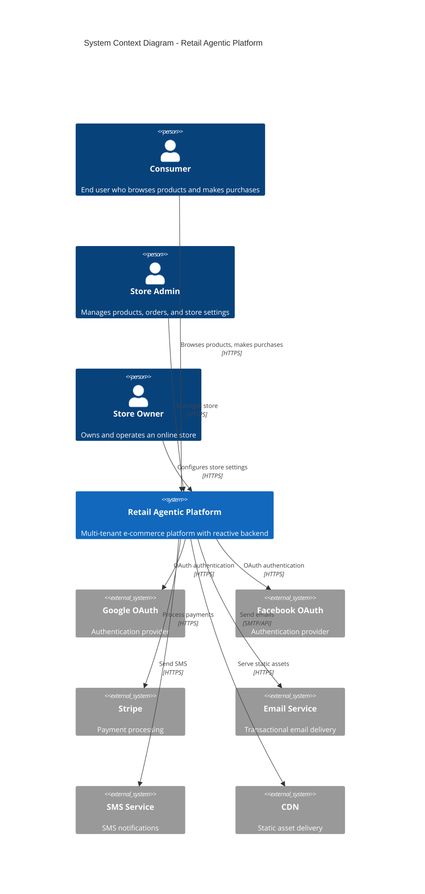
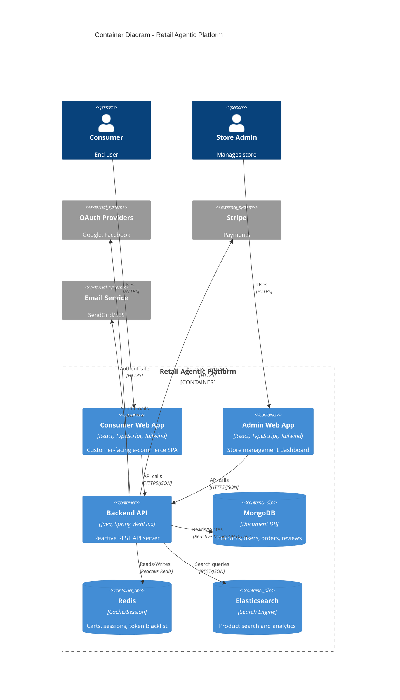
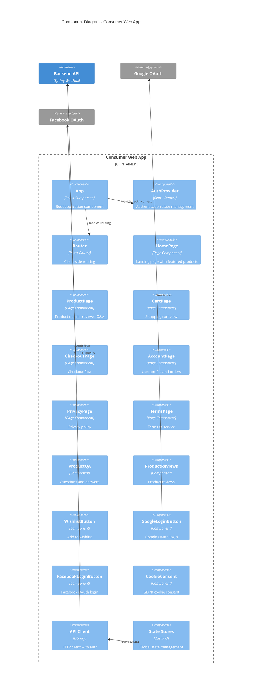
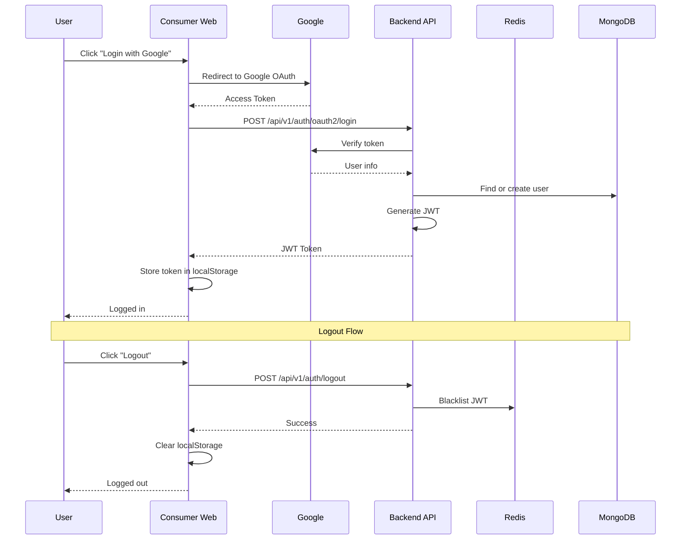
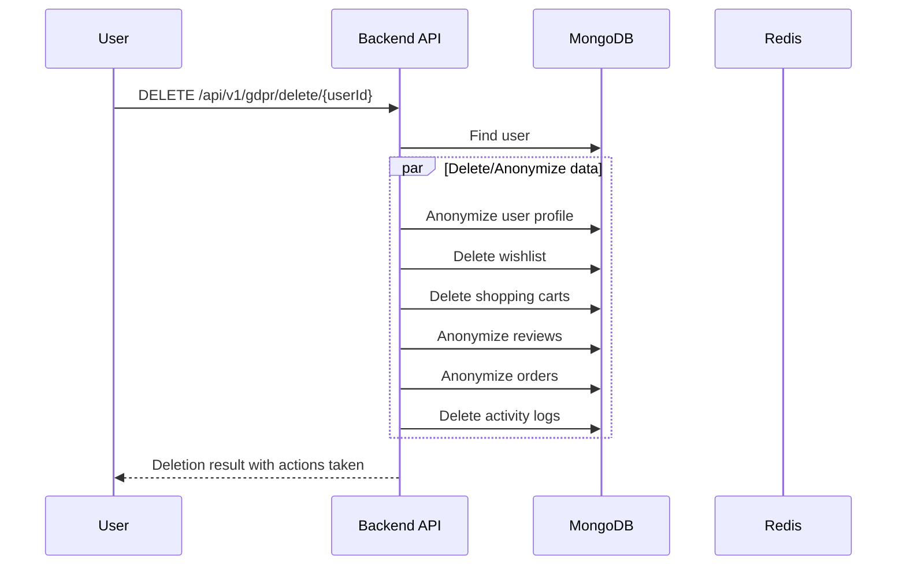
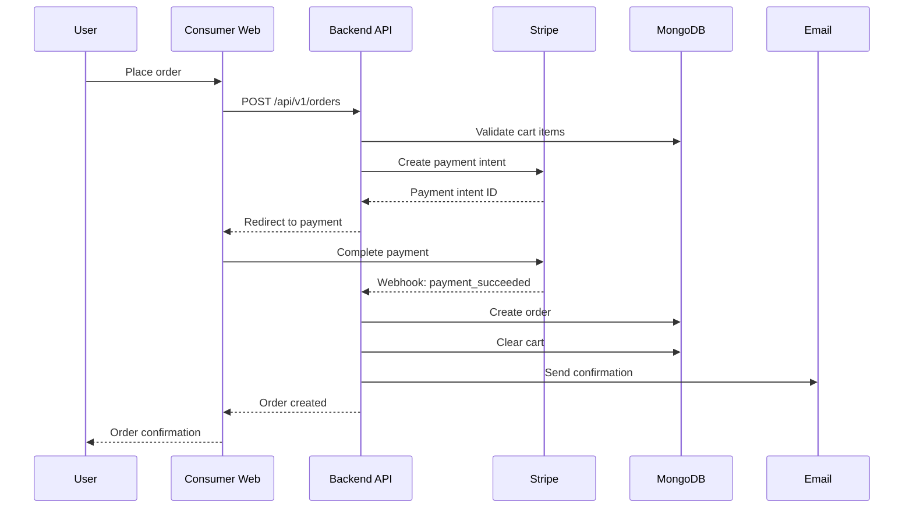

# C4 Architecture Diagrams

This document provides C4 model architecture diagrams for the Retail Agentic platform.

## Level 1: System Context Diagram

Shows the system's interactions with users and external systems.



## Level 2: Container Diagram

Shows the high-level technology choices and how containers communicate.



## Level 3: Component Diagram - Backend API

Shows the internal structure of the Backend API container.

```mermaid
C4Component
    title Component Diagram - Backend API

    Container_Boundary(api, "Backend API") {
        Component(auth_controller, "AuthController", "REST Controller", "Handles authentication, OAuth2 login/logout")
        Component(product_controller, "ProductController", "REST Controller", "Product CRUD operations")
        Component(order_controller, "OrderController", "REST Controller", "Order management")
        Component(cart_controller, "CartController", "REST Controller", "Shopping cart operations")
        Component(user_controller, "UserController", "REST Controller", "User profile management")
        Component(gdpr_controller, "GdprController", "REST Controller", "GDPR data export/deletion")
        Component(review_controller, "ReviewController", "REST Controller", "Product reviews")
        Component(qa_controller, "QAController", "REST Controller", "Product Q&A")
        Component(wishlist_controller, "WishlistController", "REST Controller", "Wishlist management")

        Component(jwt_filter, "JwtAuthenticationFilter", "WebFilter", "JWT validation, blacklist checking")
        Component(tenant_filter, "TenantContextFilter", "WebFilter", "Multi-tenant context setup")

        Component(user_service, "UserService", "Service", "User business logic")
        Component(product_service, "ProductService", "Service", "Product catalog logic")
        Component(order_service, "OrderService", "Service", "Order processing")
        Component(cart_service, "CartService", "Service", "Cart management")
        Component(oauth2_service, "OAuth2Service", "Service", "OAuth2 authentication")
        Component(gdpr_service, "GdprDataDeletionService", "Service", "GDPR compliance")
        Component(notification_service, "NotificationService", "Service", "Email/SMS sending")

        Component(jwt_service, "JwtService", "Security", "JWT token generation/validation")
        Component(blacklist_service, "TokenBlacklistService", "Security", "Token blacklist management")

        Component(user_repo, "UserRepository", "Repository", "User data access")
        Component(product_repo, "ProductRepository", "Repository", "Product data access")
        Component(order_repo, "OrderRepository", "Repository", "Order data access")
    }

    ContainerDb(mongodb, "MongoDB", "Document DB")
    ContainerDb(redis, "Redis", "Cache")
    System_Ext(oauth, "OAuth Providers")

    Rel(auth_controller, oauth2_service, "Uses")
    Rel(auth_controller, jwt_service, "Uses")
    Rel(auth_controller, blacklist_service, "Uses")

    Rel(jwt_filter, jwt_service, "Validates tokens")
    Rel(jwt_filter, blacklist_service, "Checks blacklist")

    Rel(user_service, user_repo, "Uses")
    Rel(product_service, product_repo, "Uses")
    Rel(order_service, order_repo, "Uses")

    Rel(oauth2_service, oauth, "Authenticates")
    Rel(user_repo, mongodb, "Reads/Writes")
    Rel(blacklist_service, redis, "Reads/Writes")
```



## Level 3: Component Diagram - Consumer Web App



## Data Flow Diagrams

### Authentication Flow



### GDPR Data Deletion Flow



### Order Processing Flow



## Infrastructure Overview

```
┌─────────────────────────────────────────────────────────────────┐
│                        Load Balancer                             │
│                         (HTTPS/SSL)                              │
└─────────────────────────────────────────────────────────────────┘
                              │
         ┌────────────────────┼────────────────────┐
         │                    │                    │
         ▼                    ▼                    ▼
┌─────────────────┐  ┌─────────────────┐  ┌─────────────────┐
│  Consumer Web   │  │   Admin Web     │  │   Backend API   │
│    (CDN)        │  │    (CDN)        │  │   (Container)   │
│                 │  │                 │  │                 │
│  - React SPA    │  │  - React SPA    │  │  - Spring Boot  │
│  - Tailwind     │  │  - Tailwind     │  │  - WebFlux      │
└─────────────────┘  └─────────────────┘  └────────┬────────┘
                                                    │
                    ┌───────────────────────────────┼──────────────┐
                    │                               │              │
                    ▼                               ▼              ▼
           ┌─────────────────┐            ┌──────────────┐  ┌───────────┐
           │    MongoDB      │            │    Redis     │  │Elasticsearch│
           │   (Replica Set) │            │  (Cluster)   │  │ (Cluster) │
           │                 │            │              │  │           │
           │ - Products      │            │ - Sessions   │  │ - Search  │
           │ - Users         │            │ - Carts      │  │ - Analytics│
           │ - Orders        │            │ - Blacklist  │  │           │
           │ - Reviews       │            │ - Cache      │  │           │
           └─────────────────┘            └──────────────┘  └───────────┘
```

## Technology Stack Summary

| Layer | Technology | Purpose |
|-------|------------|---------|
| Frontend | React 18, TypeScript, Tailwind CSS | User interface |
| UI Components | shadcn/ui | Design system |
| State Management | Zustand | Global state |
| API Client | Axios | HTTP requests |
| Backend | Java 21, Spring Boot 3.x | Application server |
| Reactive | Spring WebFlux, Project Reactor | Non-blocking I/O |
| Security | Spring Security, JWT | Authentication |
| Primary DB | MongoDB | Document storage |
| Cache | Redis | Caching, sessions |
| Search | Elasticsearch | Full-text search |
| Payments | Stripe | Payment processing |
| Email | SendGrid/SES | Transactional email |
| OAuth | Google, Facebook | Social login |

## Key Architecture Decisions

1. **Reactive Stack**: Spring WebFlux for non-blocking I/O handling high concurrency
2. **Multi-Tenant**: Shared database with tenant discriminator for cost efficiency
3. **Polyglot Persistence**: MongoDB for flexibility, Redis for speed, Elasticsearch for search
4. **Event-Driven**: Async processing for non-critical operations (emails, analytics)
5. **JWT + Blacklist**: Stateless auth with Redis-backed token invalidation
6. **CDN-First**: Static assets served via CDN for performance
