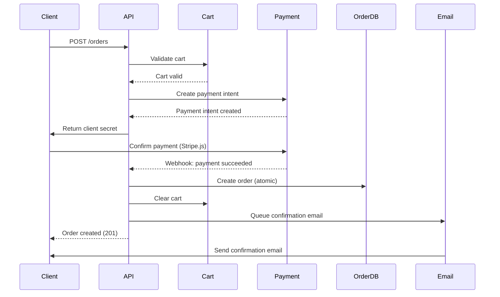
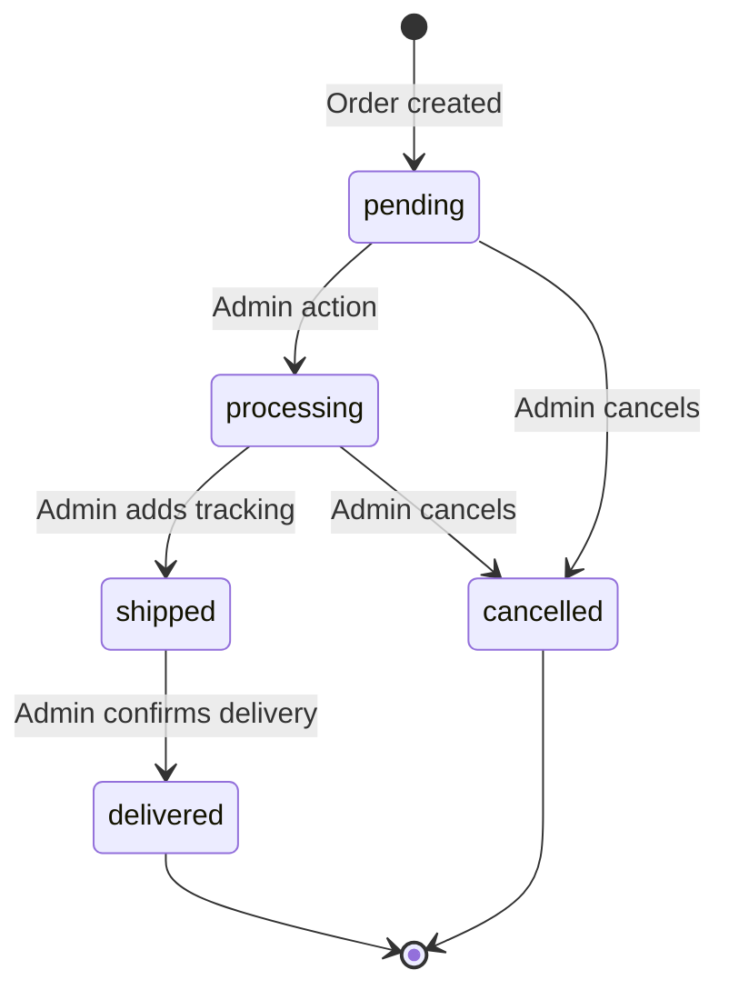

# Retail Agentic MVP - API Specifications

**Version**: 1.0
**Last Updated**: November 21, 2024
**Status**: Draft

---

## Table of Contents

1. [Overview](#overview)
2. [API Design Principles](#api-design-principles)
3. [Authentication & Authorization](#authentication--authorization)
4. [Multi-Tenancy](#multi-tenancy)
5. [Product API](#product-api)
6. [Cart API](#cart-api)
7. [Order API](#order-api)
8. [Store API](#store-api)
9. [Error Handling](#error-handling)
10. [Rate Limiting](#rate-limiting)
11. [Webhooks](#webhooks-future)

---

## Overview

This document specifies the REST API for the Retail Agentic platform. All APIs follow reactive patterns using Spring WebFlux and return `Mono<T>` or `Flux<T>`.

**Base URL**: `https://{tenant}.retail-agentic.com/api/v1`

**Content Type**: `application/json`

**API Versioning**: URL path versioning (`/api/v1/...`)

---

## API Design Principles

### Reactive Programming
- All endpoints return reactive types (`Mono` or `Flux`)
- Non-blocking I/O throughout the stack
- Backpressure handling for streams
- Proper error propagation

### RESTful Conventions
- Use HTTP methods semantically (GET, POST, PUT, DELETE)
- Use nouns for resources (not verbs)
- Use plural nouns for collections
- Use nested resources for relationships

### Response Format
- Consistent JSON structure
- ISO 8601 timestamps
- Pagination metadata for lists
- HATEOAS links (future enhancement)

### Error Handling
- Consistent error response format
- Meaningful error messages
- Appropriate HTTP status codes
- Error codes for programmatic handling

---

## Authentication & Authorization

### Customer Authentication (MVP: Session-based)
- Session cookie for cart persistence
- No login required for guest checkout
- Session ID: `SESSION_ID` cookie (httpOnly, secure)

**Future**: Customer accounts with JWT

### Admin Authentication (JWT)
- JWT bearer token in `Authorization` header
- Token format: `Bearer {token}`
- Token expiration: 24 hours
- Refresh token support (future)

**Admin Login Endpoint**:
```
POST /api/v1/auth/login
```

**Request**:
```json
{
  "email": "admin@store.com",
  "password": "securePassword123"
}
```

**Response**:
```json
{
  "token": "eyJhbGciOiJIUzI1NiIs...",
  "expiresAt": "2024-11-22T10:00:00Z",
  "user": {
    "id": "uuid",
    "email": "admin@store.com",
    "tenantId": "uuid",
    "role": "ADMIN"
  }
}
```

---

## Multi-Tenancy

### Tenant Resolution

**Strategy 1: Subdomain**
- URL: `https://store1.retail-agentic.com/api/v1/products`
- Tenant extracted from subdomain: `store1`

**Strategy 2: Path**
- URL: `https://retail-agentic.com/store1/api/v1/products`
- Tenant extracted from path: `store1`

**Implementation**:
- Tenant resolved at filter/gateway layer
- Tenant context propagated via Reactor Context
- All data operations automatically filter by `tenantId`

### Tenant Context
```java
// Set tenant in reactive context
Mono.deferContextual(ctx -> {
    String tenantId = ctx.get("tenantId");
    // ... use tenantId in queries
});
```

---

## Product API

### List Products

**Endpoint**: `GET /api/v1/products`

**Description**: Retrieve paginated list of products with optional filters.

**Query Parameters**:
| Parameter | Type | Required | Default | Description |
|-----------|------|----------|---------|-------------|
| `page` | integer | No | 0 | Page number (0-indexed) |
| `size` | integer | No | 20 | Items per page (max 100) |
| `sort` | string | No | `createdAt:desc` | Sort field and direction (e.g., `price:asc`) |
| `category` | string[] | No | - | Filter by categories |
| `priceMin` | decimal | No | - | Minimum price filter |
| `priceMax` | decimal | No | - | Maximum price filter |
| `status` | string | No | `active` | Filter by status (`active`, `inactive`, `all`) |

**Example Request**:
```
GET /api/v1/products?page=0&size=20&category=Electronics&priceMin=50&priceMax=500&sort=price:asc
```

**Response** (200 OK):
```json
{
  "content": [
    {
      "id": "550e8400-e29b-41d4-a716-446655440000",
      "name": "Wireless Mouse",
      "sku": "MOUSE-001",
      "description": "Ergonomic wireless mouse with 2.4GHz connectivity",
      "price": 29.99,
      "currency": "USD",
      "category": ["Electronics", "Accessories"],
      "images": [
        {
          "url": "https://cdn.example.com/mouse-001.jpg",
          "alt": "Wireless mouse front view",
          "order": 0
        }
      ],
      "attributes": {
        "color": "Black",
        "connectivity": "Wireless",
        "brand": "TechBrand"
      },
      "stock": 150,
      "status": "active",
      "createdAt": "2024-11-21T10:00:00Z",
      "updatedAt": "2024-11-21T10:00:00Z"
    }
  ],
  "page": {
    "number": 0,
    "size": 20,
    "totalElements": 100,
    "totalPages": 5
  }
}
```

---

### Search Products

**Endpoint**: `GET /api/v1/products/search`

**Description**: Full-text search using Elasticsearch with advanced filtering.

**Query Parameters**:
| Parameter | Type | Required | Default | Description |
|-----------|------|----------|---------|-------------|
| `q` | string | Yes | - | Search query (searches name, description, SKU) |
| `page` | integer | No | 0 | Page number |
| `size` | integer | No | 20 | Items per page |
| `category` | string[] | No | - | Filter by categories |
| `attributes` | object | No | - | Filter by attributes (e.g., `color=blue&size=medium`) |
| `priceMin` | decimal | No | - | Minimum price |
| `priceMax` | decimal | No | - | Maximum price |

**Example Request**:
```
GET /api/v1/products/search?q=wireless+mouse&category=Electronics&attributes[color]=black&priceMax=50
```

**Response** (200 OK):
```json
{
  "content": [
    {
      "id": "550e8400-e29b-41d4-a716-446655440000",
      "name": "Wireless Mouse",
      "sku": "MOUSE-001",
      "description": "Ergonomic <mark>wireless</mark> <mark>mouse</mark> with 2.4GHz connectivity",
      "price": 29.99,
      "currency": "USD",
      "category": ["Electronics", "Accessories"],
      "images": [...],
      "attributes": {
        "color": "Black",
        "connectivity": "Wireless"
      },
      "stock": 150,
      "status": "active",
      "relevanceScore": 9.5
    }
  ],
  "page": {...},
  "aggregations": {
    "categories": {
      "Electronics": 45,
      "Accessories": 30
    },
    "attributes": {
      "color": {
        "Black": 25,
        "White": 15,
        "Blue": 5
      }
    },
    "priceRanges": {
      "0-25": 10,
      "25-50": 20,
      "50-100": 15
    }
  }
}
```

---

### Get Product by ID

**Endpoint**: `GET /api/v1/products/{id}`

**Description**: Retrieve single product by ID.

**Path Parameters**:
- `id` (string, UUID): Product ID

**Example Request**:
```
GET /api/v1/products/550e8400-e29b-41d4-a716-446655440000
```

**Response** (200 OK):
```json
{
  "id": "550e8400-e29b-41d4-a716-446655440000",
  "name": "Wireless Mouse",
  "sku": "MOUSE-001",
  "description": "Ergonomic wireless mouse with 2.4GHz connectivity",
  "price": 29.99,
  "currency": "USD",
  "category": ["Electronics", "Accessories"],
  "images": [...],
  "attributes": {...},
  "stock": 150,
  "status": "active",
  "createdAt": "2024-11-21T10:00:00Z",
  "updatedAt": "2024-11-21T10:00:00Z"
}
```

**Error Response** (404 Not Found):
```json
{
  "error": {
    "code": "PRODUCT_NOT_FOUND",
    "message": "Product not found",
    "timestamp": "2024-11-21T10:00:00Z"
  }
}
```

---

### Create Product (Admin)

**Endpoint**: `POST /api/v1/products`

**Description**: Create a new product.

**Authentication**: Required (Admin JWT)

**Request Body**:
```json
{
  "name": "Wireless Mouse",
  "sku": "MOUSE-001",
  "description": "Ergonomic wireless mouse with 2.4GHz connectivity",
  "price": 29.99,
  "currency": "USD",
  "category": ["Electronics", "Accessories"],
  "images": [
    {
      "url": "https://cdn.example.com/mouse-001.jpg",
      "alt": "Wireless mouse front view",
      "order": 0
    }
  ],
  "attributes": {
    "color": "Black",
    "connectivity": "Wireless",
    "brand": "TechBrand"
  },
  "stock": 150,
  "status": "active"
}
```

**Response** (201 Created):
```json
{
  "id": "550e8400-e29b-41d4-a716-446655440000",
  "name": "Wireless Mouse",
  "sku": "MOUSE-001",
  ...
  "createdAt": "2024-11-21T10:00:00Z",
  "updatedAt": "2024-11-21T10:00:00Z"
}
```

**Error Response** (400 Bad Request):
```json
{
  "error": {
    "code": "VALIDATION_ERROR",
    "message": "Validation failed",
    "timestamp": "2024-11-21T10:00:00Z",
    "details": [
      {
        "field": "sku",
        "message": "SKU already exists"
      },
      {
        "field": "price",
        "message": "Price must be greater than 0"
      }
    ]
  }
}
```

---

### Update Product (Admin)

**Endpoint**: `PUT /api/v1/products/{id}`

**Description**: Update existing product.

**Authentication**: Required (Admin JWT)

**Path Parameters**:
- `id` (string, UUID): Product ID

**Request Body**: Same as Create Product

**Response** (200 OK): Updated product object

**Error Response** (404 Not Found): Product not found

---

### Delete Product (Admin)

**Endpoint**: `DELETE /api/v1/products/{id}`

**Description**: Delete a product (soft delete).

**Authentication**: Required (Admin JWT)

**Path Parameters**:
- `id` (string, UUID): Product ID

**Response** (204 No Content)

**Error Response** (409 Conflict):
```json
{
  "error": {
    "code": "PRODUCT_IN_USE",
    "message": "Cannot delete product with active orders",
    "timestamp": "2024-11-21T10:00:00Z"
  }
}
```

---

## Cart API

### Get Cart

**Endpoint**: `GET /api/v1/cart`

**Description**: Retrieve current cart for session.

**Authentication**: Session cookie

**Response** (200 OK):
```json
{
  "id": "cart-uuid",
  "tenantId": "tenant-uuid",
  "sessionId": "session-uuid",
  "items": [
    {
      "id": "item-uuid",
      "productId": "product-uuid",
      "name": "Wireless Mouse",
      "sku": "MOUSE-001",
      "price": 29.99,
      "quantity": 2,
      "attributes": {
        "color": "Black"
      },
      "imageUrl": "https://cdn.example.com/mouse-001.jpg",
      "subtotal": 59.98
    }
  ],
  "summary": {
    "subtotal": 59.98,
    "tax": 5.40,
    "shipping": 5.00,
    "total": 70.38
  },
  "itemCount": 2,
  "createdAt": "2024-11-21T10:00:00Z",
  "updatedAt": "2024-11-21T10:05:00Z",
  "expiresAt": "2024-11-28T10:00:00Z"
}
```

**Response** (200 OK - Empty Cart):
```json
{
  "id": null,
  "items": [],
  "summary": {
    "subtotal": 0,
    "tax": 0,
    "shipping": 0,
    "total": 0
  },
  "itemCount": 0
}
```

---

### Add Item to Cart

**Endpoint**: `POST /api/v1/cart/items`

**Description**: Add a product to cart.

**Authentication**: Session cookie

**Request Body**:
```json
{
  "productId": "product-uuid",
  "quantity": 2,
  "attributes": {
    "color": "Black",
    "size": "Medium"
  }
}
```

**Response** (200 OK): Updated cart object

**Error Response** (400 Bad Request):
```json
{
  "error": {
    "code": "INSUFFICIENT_STOCK",
    "message": "Requested quantity exceeds available stock",
    "details": {
      "requestedQuantity": 10,
      "availableStock": 5
    }
  }
}
```

---

### Update Cart Item

**Endpoint**: `PUT /api/v1/cart/items/{itemId}`

**Description**: Update quantity of cart item.

**Authentication**: Session cookie

**Path Parameters**:
- `itemId` (string, UUID): Cart item ID

**Request Body**:
```json
{
  "quantity": 5
}
```

**Response** (200 OK): Updated cart object

**Error Response** (404 Not Found): Item not in cart

---

### Remove Cart Item

**Endpoint**: `DELETE /api/v1/cart/items/{itemId}`

**Description**: Remove item from cart.

**Authentication**: Session cookie

**Path Parameters**:
- `itemId` (string, UUID): Cart item ID

**Response** (200 OK): Updated cart object

---

### Clear Cart

**Endpoint**: `DELETE /api/v1/cart`

**Description**: Remove all items from cart.

**Authentication**: Session cookie

**Response** (204 No Content)

---

## Order API

### Create Order (Checkout)

**Endpoint**: `POST /api/v1/orders`

**Description**: Create order and process payment.

**Authentication**: Session cookie

**Request Body**:
```json
{
  "customer": {
    "email": "customer@example.com",
    "name": "John Doe"
  },
  "shippingAddress": {
    "line1": "123 Main St",
    "line2": "Apt 4",
    "city": "Springfield",
    "state": "IL",
    "postalCode": "62701",
    "country": "US"
  },
  "shippingMethod": "standard",
  "paymentMethod": {
    "type": "card",
    "stripePaymentMethodId": "pm_1234567890"
  }
}
```

**Response** (201 Created):
```json
{
  "id": "order-uuid",
  "orderNumber": "ORD-2024-00123",
  "customer": {
    "email": "customer@example.com",
    "name": "John Doe"
  },
  "shippingAddress": {...},
  "items": [...],
  "pricing": {
    "subtotal": 59.98,
    "shipping": 5.00,
    "tax": 5.40,
    "total": 70.38
  },
  "payment": {
    "method": "card",
    "status": "paid",
    "transactionId": "stripe_xyz123"
  },
  "status": "pending",
  "trackingUrl": "https://store.com/orders/order-uuid?token=secure-token",
  "createdAt": "2024-11-21T10:00:00Z",
  "estimatedDelivery": "2024-11-28T10:00:00Z"
}
```

**Error Response** (400 Bad Request - Payment Failed):
```json
{
  "error": {
    "code": "PAYMENT_FAILED",
    "message": "Payment was declined",
    "details": {
      "reason": "insufficient_funds",
      "stripeError": "Your card has insufficient funds."
    }
  }
}
```

**Checkout Flow Diagram**:



---

### Get Order by ID

**Endpoint**: `GET /api/v1/orders/{id}`

**Description**: Retrieve order details (public with token or admin).

**Authentication**: Query param `?token={secureToken}` OR Admin JWT

**Path Parameters**:
- `id` (string, UUID): Order ID

**Query Parameters**:
- `token` (string): Secure access token (for customer access)

**Example Request**:
```
GET /api/v1/orders/order-uuid?token=secure-token
```

**Response** (200 OK):
```json
{
  "id": "order-uuid",
  "orderNumber": "ORD-2024-00123",
  "customer": {...},
  "shippingAddress": {...},
  "items": [...],
  "pricing": {...},
  "payment": {...},
  "status": "shipped",
  "statusHistory": [
    {
      "status": "pending",
      "timestamp": "2024-11-21T10:00:00Z",
      "note": "Order placed"
    },
    {
      "status": "processing",
      "timestamp": "2024-11-21T11:00:00Z",
      "note": "Order being prepared"
    },
    {
      "status": "shipped",
      "timestamp": "2024-11-22T09:00:00Z",
      "note": "Order shipped via USPS",
      "trackingNumber": "9400111899562901234567"
    }
  ],
  "trackingNumber": "9400111899562901234567",
  "trackingUrl": "https://tools.usps.com/go/TrackConfirmAction?tLabels=9400111899562901234567",
  "createdAt": "2024-11-21T10:00:00Z",
  "estimatedDelivery": "2024-11-28T10:00:00Z"
}
```

**Error Response** (403 Forbidden):
```json
{
  "error": {
    "code": "INVALID_TOKEN",
    "message": "Invalid or expired access token"
  }
}
```

---

### List Orders (Admin)

**Endpoint**: `GET /api/v1/orders`

**Description**: Retrieve paginated list of orders with filters.

**Authentication**: Required (Admin JWT)

**Query Parameters**:
| Parameter | Type | Required | Default | Description |
|-----------|------|----------|---------|-------------|
| `page` | integer | No | 0 | Page number |
| `size` | integer | No | 50 | Items per page |
| `status` | string | No | `all` | Filter by status |
| `dateFrom` | date | No | - | Start date (ISO 8601) |
| `dateTo` | date | No | - | End date (ISO 8601) |
| `customerEmail` | string | No | - | Filter by customer email |
| `sort` | string | No | `createdAt:desc` | Sort field and direction |

**Example Request**:
```
GET /api/v1/orders?status=pending&dateFrom=2024-11-01&dateTo=2024-11-21&page=0&size=50
```

**Response** (200 OK):
```json
{
  "content": [
    {
      "id": "order-uuid",
      "orderNumber": "ORD-2024-00123",
      "customer": {
        "name": "John Doe",
        "email": "customer@example.com"
      },
      "status": "pending",
      "total": 70.38,
      "itemCount": 2,
      "createdAt": "2024-11-21T10:00:00Z"
    }
  ],
  "page": {
    "number": 0,
    "size": 50,
    "totalElements": 150,
    "totalPages": 3
  }
}
```

---

### Update Order Status (Admin)

**Endpoint**: `PUT /api/v1/orders/{id}/status`

**Description**: Update order status and trigger customer notification.

**Authentication**: Required (Admin JWT)

**Path Parameters**:
- `id` (string, UUID): Order ID

**Request Body**:
```json
{
  "status": "shipped",
  "trackingNumber": "9400111899562901234567",
  "carrier": "USPS",
  "note": "Order shipped via USPS Priority Mail"
}
```

**Response** (200 OK): Updated order object

**Error Response** (400 Bad Request):
```json
{
  "error": {
    "code": "INVALID_STATUS_TRANSITION",
    "message": "Cannot transition from 'shipped' to 'pending'",
    "details": {
      "currentStatus": "shipped",
      "requestedStatus": "pending",
      "allowedTransitions": ["delivered"]
    }
  }
}
```

**Status Workflow**:



---

## Store API

### Get Store Configuration

**Endpoint**: `GET /api/v1/store/config`

**Description**: Retrieve store branding and settings.

**Authentication**: None (public)

**Response** (200 OK):
```json
{
  "tenantId": "tenant-uuid",
  "name": "My Awesome Store",
  "description": "The best products online",
  "contactEmail": "support@mystore.com",
  "phone": "+1-555-123-4567",
  "branding": {
    "logoUrl": "https://cdn.example.com/logo.png",
    "primaryColor": "#1E40AF",
    "secondaryColor": "#9333EA",
    "accentColor": "#F59E0B",
    "fontFamily": "Inter"
  },
  "domain": {
    "subdomain": "mystore",
    "customDomain": "www.mystore.com"
  },
  "settings": {
    "currency": "USD",
    "taxRate": 0.09,
    "freeShippingThreshold": 50.00
  }
}
```

---

### Update Store Configuration (Admin)

**Endpoint**: `PUT /api/v1/store/config`

**Description**: Update store settings and branding.

**Authentication**: Required (Admin JWT)

**Request Body**: Same as Get Store Configuration

**Response** (200 OK): Updated configuration object

---

### Upload Store Logo (Admin)

**Endpoint**: `POST /api/v1/store/logo`

**Description**: Upload store logo image.

**Authentication**: Required (Admin JWT)

**Request**: `multipart/form-data`
- `file`: Image file (PNG, JPG, SVG, max 2MB)

**Response** (200 OK):
```json
{
  "logoUrl": "https://cdn.example.com/logos/tenant-uuid/logo.png",
  "uploadedAt": "2024-11-21T10:00:00Z"
}
```

**Error Response** (400 Bad Request):
```json
{
  "error": {
    "code": "INVALID_FILE_TYPE",
    "message": "File type not supported. Allowed: PNG, JPG, SVG",
    "details": {
      "receivedType": "image/gif",
      "allowedTypes": ["image/png", "image/jpeg", "image/svg+xml"]
    }
  }
}
```

---

## Error Handling

### Error Response Format

All error responses follow this structure:

```json
{
  "error": {
    "code": "ERROR_CODE",
    "message": "Human-readable error message",
    "timestamp": "2024-11-21T10:00:00Z",
    "details": {
      "additionalInfo": "..."
    }
  }
}
```

### HTTP Status Codes

| Status Code | Meaning | Use Case |
|-------------|---------|----------|
| 200 OK | Success | Successful GET, PUT, POST (with body) |
| 201 Created | Resource created | Successful POST (new resource) |
| 204 No Content | Success, no body | Successful DELETE |
| 400 Bad Request | Validation error | Invalid input, business rule violation |
| 401 Unauthorized | Authentication required | Missing or invalid auth token |
| 403 Forbidden | Authorization failed | Insufficient permissions |
| 404 Not Found | Resource not found | Requested resource doesn't exist |
| 409 Conflict | Conflict | Duplicate resource (e.g., SKU) |
| 422 Unprocessable Entity | Validation error | Semantic validation failed |
| 429 Too Many Requests | Rate limit exceeded | Too many requests from client |
| 500 Internal Server Error | Server error | Unexpected server-side error |
| 503 Service Unavailable | Service down | Maintenance or overload |

### Error Codes

| Code | HTTP Status | Description |
|------|-------------|-------------|
| `VALIDATION_ERROR` | 400 | Input validation failed |
| `PRODUCT_NOT_FOUND` | 404 | Product doesn't exist |
| `ORDER_NOT_FOUND` | 404 | Order doesn't exist |
| `INSUFFICIENT_STOCK` | 400 | Not enough stock available |
| `PAYMENT_FAILED` | 400 | Payment processing failed |
| `INVALID_TOKEN` | 403 | Invalid access token |
| `INVALID_STATUS_TRANSITION` | 400 | Invalid order status change |
| `PRODUCT_IN_USE` | 409 | Cannot delete product with orders |
| `DUPLICATE_SKU` | 409 | SKU already exists |
| `RATE_LIMIT_EXCEEDED` | 429 | Too many requests |
| `INTERNAL_ERROR` | 500 | Unexpected server error |

---

## Rate Limiting

### Strategy
- Per-tenant rate limiting
- Token bucket algorithm
- Limits stored in Redis

### Limits (MVP)

| Endpoint Type | Limit | Window |
|---------------|-------|--------|
| Public (GET) | 100 req/min | Per tenant |
| Search | 30 req/min | Per tenant |
| Cart operations | 50 req/min | Per session |
| Admin (read) | 200 req/min | Per user |
| Admin (write) | 50 req/min | Per user |
| Checkout | 10 req/min | Per session |

### Rate Limit Headers

Response includes rate limit information:

```
X-RateLimit-Limit: 100
X-RateLimit-Remaining: 95
X-RateLimit-Reset: 1700000000
```

### Rate Limit Exceeded Response (429)

```json
{
  "error": {
    "code": "RATE_LIMIT_EXCEEDED",
    "message": "Too many requests. Please try again later.",
    "details": {
      "limit": 100,
      "window": "60s",
      "retryAfter": 45
    }
  }
}
```

---

## Webhooks (Future)

Webhook support for real-time event notifications (post-MVP).

### Event Types
- `order.created`
- `order.updated`
- `order.status_changed`
- `product.created`
- `product.updated`
- `product.deleted`
- `product.out_of_stock`

### Webhook Payload Example

```json
{
  "id": "event-uuid",
  "type": "order.created",
  "timestamp": "2024-11-21T10:00:00Z",
  "tenantId": "tenant-uuid",
  "data": {
    "order": {...}
  }
}
```

---

## API Specification Files

### OpenAPI/Swagger

Full OpenAPI 3.0 specification available at:
```
GET /api/v1/docs/openapi.json
```

### Interactive API Documentation

Swagger UI available at:
```
GET /api/v1/docs
```

---

**Document Status**: Draft
**Next Review Date**: TBD
**Approval Required From**: Backend Lead, Product Manager

---

**Version History**:

| Version | Date | Author | Changes |
|---------|------|--------|---------|
| 1.0 | 2024-11-21 | Product Manager Agent | Initial API specifications |
