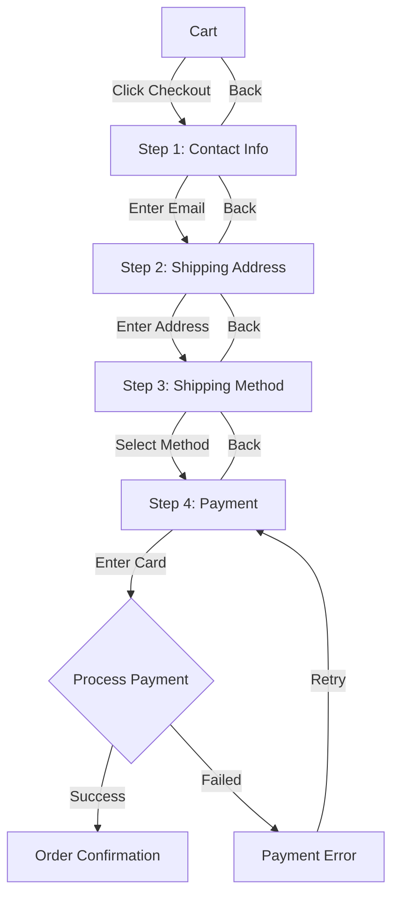
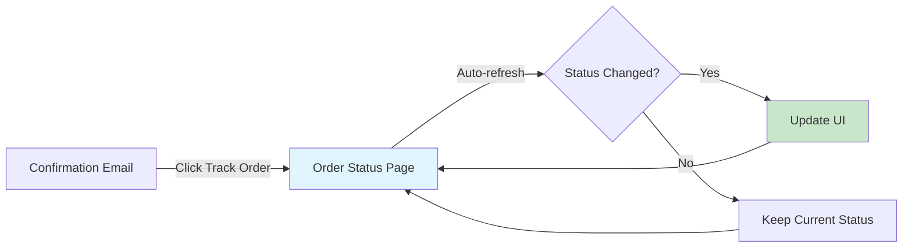
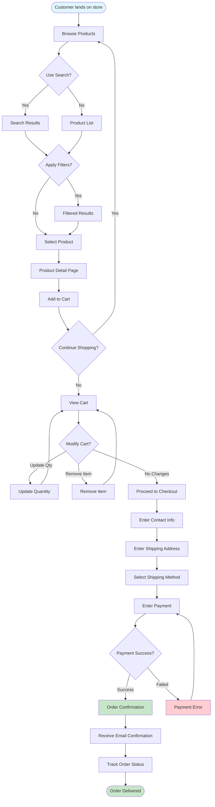
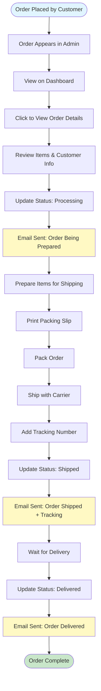
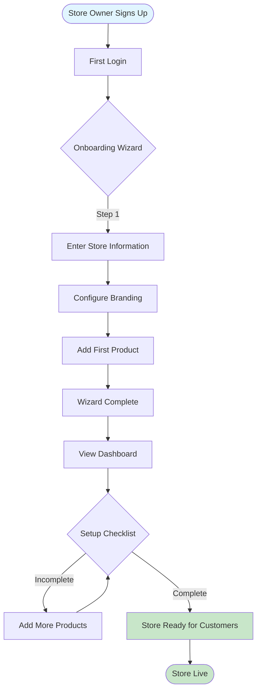
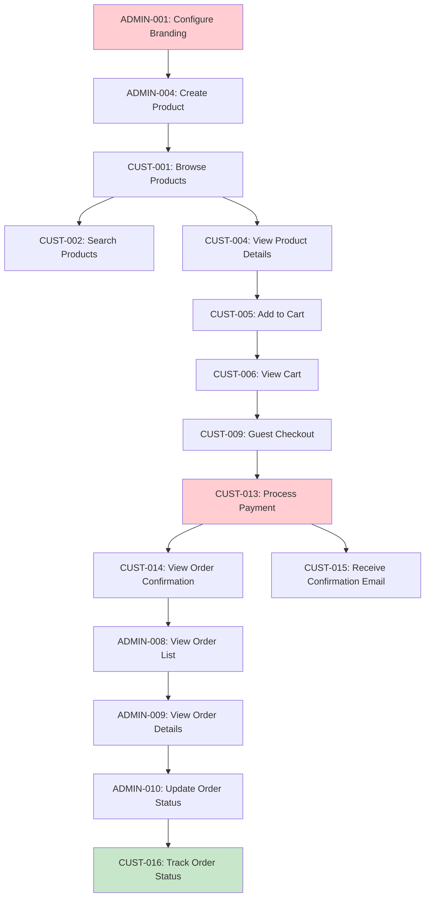

# Retail Agentic MVP - User Stories

**Version**: 1.0
**Last Updated**: November 21, 2024
**Status**: Draft

---

## Table of Contents

1. [Overview](#overview)
2. [Story Format](#story-format)
3. [Customer Stories (Consumer Web)](#customer-stories-consumer-web)
4. [Store Owner Stories (Admin Web)](#store-owner-stories-admin-web)
5. [User Flows](#user-flows)

---

## Overview

This document contains detailed user stories for the Retail Agentic MVP. Stories are organized by user type and prioritized for implementation.

**Story Status**:
- 🔴 **P0** - Critical for MVP (must have)
- 🟡 **P1** - Important for MVP (should have)
- 🟢 **P2** - Nice to have for MVP (could have)

---

## Story Format

Each story follows this template:

**Story ID**: [USER-XXX]
**Title**: [Short description]
**Priority**: [P0/P1/P2]
**User Type**: [Customer/Store Owner]
**Epic**: [Feature area]

**User Story**:
> As a [user type], I want to [goal] so that [reason].

**Acceptance Criteria**:
- [ ] Criterion 1
- [ ] Criterion 2
- [ ] Criterion 3

**Technical Notes**: [Implementation details]
**Dependencies**: [Other stories or services]
**Estimated Effort**: [S/M/L/XL]

---

## Customer Stories (Consumer Web)

### Epic: Product Discovery

#### CUST-001: Browse Products
**Priority**: 🔴 P0
**User Type**: Customer
**Epic**: Product Discovery

**User Story**:
> As a customer, I want to browse products in a grid layout so that I can quickly scan available items.

**Acceptance Criteria**:
- [ ] Products displayed in responsive grid (2 cols mobile, 4 cols desktop)
- [ ] Each card shows: image, name, price, primary attribute (e.g., color)
- [ ] Grid loads 20 products per page
- [ ] Pagination controls at bottom
- [ ] Loading skeletons while fetching
- [ ] "No products" empty state with illustration
- [ ] Page loads in <2 seconds

**Technical Notes**:
- Use CSS Grid with responsive breakpoints
- Implement infinite scroll or pagination (pagination preferred for MVP)
- Lazy load images with placeholder

**Dependencies**: Product API, Image CDN
**Estimated Effort**: M

---

#### CUST-002: Search Products
**Priority**: 🔴 P0
**User Type**: Customer
**Epic**: Product Discovery

**User Story**:
> As a customer, I want to search for products by name or keyword so that I can find specific items quickly.

**Acceptance Criteria**:
- [ ] Search bar visible in header on all pages
- [ ] Search executes on Enter key or button click
- [ ] Results appear in <1 second
- [ ] Search terms highlighted in results
- [ ] Auto-suggest shows after typing 3+ characters
- [ ] At least 5 suggestions displayed
- [ ] "No results" state with alternative suggestions
- [ ] Search query preserved in URL (shareable)

**Technical Notes**:
- Elasticsearch full-text search
- Debounce auto-suggest (300ms)
- Use query parameter: `?q=search+term`

**Dependencies**: Elasticsearch, Product API
**Estimated Effort**: L

---

#### CUST-003: Filter Products
**Priority**: 🟡 P1
**User Type**: Customer
**Epic**: Product Discovery

**User Story**:
> As a customer, I want to filter products by attributes (color, size, price, category) so that I can narrow down my options.

**Acceptance Criteria**:
- [ ] Filter panel on left sidebar (desktop) or drawer (mobile)
- [ ] Filters available:
  - [ ] Price range (slider)
  - [ ] Category (checkbox tree)
  - [ ] Color (color swatches)
  - [ ] Size (checkbox list)
  - [ ] Other dynamic attributes
- [ ] Show result count for each filter option
- [ ] Multiple filters combine with AND logic
- [ ] Applied filters shown as removable chips
- [ ] "Clear all filters" button
- [ ] Filters update results without page reload
- [ ] Filter state preserved in URL

**Technical Notes**:
- Use Elasticsearch aggregations for filter counts
- URL format: `?filters[color]=blue&filters[size]=medium&priceMin=10&priceMax=50`

**Dependencies**: Elasticsearch aggregations, Product API
**Estimated Effort**: L

---

#### CUST-004: View Product Details
**Priority**: 🔴 P0
**User Type**: Customer
**Epic**: Product Discovery

**User Story**:
> As a customer, I want to view detailed product information so that I can make an informed purchase decision.

**Acceptance Criteria**:
- [ ] Product image gallery (3-5 images)
- [ ] Image zoom on hover (desktop)
- [ ] Swipeable gallery (mobile)
- [ ] Product name, SKU, price displayed prominently
- [ ] Full description (supports markdown formatting)
- [ ] Attribute selectors (color, size, etc.) if applicable
- [ ] Stock availability indicator (In Stock / Low Stock / Out of Stock)
- [ ] Quantity selector (1-99)
- [ ] "Add to Cart" button (primary CTA)
- [ ] Breadcrumb navigation
- [ ] Related products (optional for MVP)
- [ ] Page loads in <2 seconds

**Technical Notes**:
- Use image CDN for optimized delivery
- Markdown rendering library for description
- Dynamic attribute rendering based on product type

**Dependencies**: Product API, Image CDN
**Estimated Effort**: L

---

### Epic: Shopping Cart

#### CUST-005: Add to Cart
**Priority**: 🔴 P0
**User Type**: Customer
**Epic**: Shopping Cart

**User Story**:
> As a customer, I want to add products to my cart so that I can purchase multiple items together.

**Acceptance Criteria**:
- [ ] "Add to Cart" button on product detail page
- [ ] Quantity selector before adding
- [ ] Button shows loading state during add
- [ ] Success feedback (toast notification)
- [ ] Cart icon badge updates with item count
- [ ] Error handling if out of stock
- [ ] Cart persists across browser sessions
- [ ] Action completes in <500ms

**Technical Notes**:
- POST to Cart API
- Update cart count in global state (React Context)
- Toast notification library (react-hot-toast or similar)

**Dependencies**: Cart API, Redis
**Estimated Effort**: M

---

#### CUST-006: View Cart
**Priority**: 🔴 P0
**User Type**: Customer
**Epic**: Shopping Cart

**User Story**:
> As a customer, I want to view my cart contents so that I can review items before checkout.

**Acceptance Criteria**:
- [ ] Cart accessible from header icon
- [ ] Cart shows as drawer (slide-in) or full page
- [ ] Each line item displays:
  - [ ] Product image (thumbnail)
  - [ ] Product name
  - [ ] Selected attributes (color, size)
  - [ ] Unit price
  - [ ] Quantity with +/- controls
  - [ ] Line subtotal
- [ ] Cart summary shows:
  - [ ] Subtotal
  - [ ] Tax estimate
  - [ ] Shipping estimate (or "Calculated at checkout")
  - [ ] Total
- [ ] "Continue Shopping" button
- [ ] "Checkout" button (primary CTA)
- [ ] Empty cart state with illustration

**Technical Notes**:
- Real-time price recalculation on quantity change
- Optimistic UI updates with rollback on error

**Dependencies**: Cart API
**Estimated Effort**: M

---

#### CUST-007: Update Cart Quantity
**Priority**: 🔴 P0
**User Type**: Customer
**Epic**: Shopping Cart

**User Story**:
> As a customer, I want to change the quantity of items in my cart so that I can purchase the right amount.

**Acceptance Criteria**:
- [ ] +/- buttons on each line item
- [ ] Direct input field for quantity
- [ ] Quantity updates immediately (optimistic UI)
- [ ] Subtotal recalculates immediately
- [ ] Stock validation (can't exceed available stock)
- [ ] Error message if quantity exceeds stock
- [ ] Minimum quantity: 1
- [ ] Update completes in <500ms

**Technical Notes**:
- PUT request to Cart API
- Debounce direct input (500ms)

**Dependencies**: Cart API
**Estimated Effort**: S

---

#### CUST-008: Remove from Cart
**Priority**: 🔴 P0
**User Type**: Customer
**Epic**: Shopping Cart

**User Story**:
> As a customer, I want to remove items from my cart so that I don't purchase unwanted products.

**Acceptance Criteria**:
- [ ] "Remove" or trash icon on each line item
- [ ] Confirmation dialog ("Are you sure?")
- [ ] Item removed immediately after confirmation
- [ ] Undo option (toast notification with "Undo" button, 5-second window)
- [ ] Cart summary recalculates
- [ ] Removal completes in <500ms

**Technical Notes**:
- DELETE request to Cart API
- Implement undo by temporarily storing removed item

**Dependencies**: Cart API
**Estimated Effort**: S

---

### Epic: Checkout

#### CUST-009: Guest Checkout
**Priority**: 🔴 P0
**User Type**: Customer
**Epic**: Checkout

**User Story**:
> As a customer, I want to checkout without creating an account so that I can complete my purchase quickly.

**Acceptance Criteria**:
- [ ] 4-step checkout flow:
  1. Contact information (email)
  2. Shipping address
  3. Shipping method
  4. Payment
- [ ] Progress indicator shows current step
- [ ] Each step validates before proceeding to next
- [ ] Back button to return to previous step
- [ ] Form data persists if user navigates back
- [ ] Order summary sidebar (visible throughout)
- [ ] Checkout completes in ≤4 clicks after cart

**Technical Notes**:
- Use React Hook Form for form management
- Multi-step form component
- Store form data in React state (or session storage)

**Dependencies**: Cart API, Order API, Stripe
**Estimated Effort**: XL

**User Flow**:



---

#### CUST-010: Enter Contact Information
**Priority**: 🔴 P0
**User Type**: Customer
**Epic**: Checkout

**User Story**:
> As a customer, I want to provide my email address so that I can receive order confirmation and updates.

**Acceptance Criteria**:
- [ ] Email input field
- [ ] Email validation (format)
- [ ] Error message for invalid email
- [ ] "Continue" button to next step
- [ ] Button disabled until email valid
- [ ] Auto-focus email field on page load

**Technical Notes**:
- Use HTML5 email input type
- Regex validation for email format

**Dependencies**: None
**Estimated Effort**: S

---

#### CUST-011: Enter Shipping Address
**Priority**: 🔴 P0
**User Type**: Customer
**Epic**: Checkout

**User Story**:
> As a customer, I want to enter my shipping address so that my order can be delivered to the correct location.

**Acceptance Criteria**:
- [ ] Form fields:
  - [ ] Full name (required)
  - [ ] Address line 1 (required)
  - [ ] Address line 2 (optional)
  - [ ] City (required)
  - [ ] State/Province (dropdown, required)
  - [ ] Postal/ZIP code (required)
  - [ ] Country (dropdown, required, default: US)
- [ ] Inline validation for all fields
- [ ] Error messages for missing/invalid fields
- [ ] "Continue" button to next step
- [ ] Button disabled until form valid

**Technical Notes**:
- Address autocomplete (Google Places API - optional for MVP)
- Basic format validation (no address verification for MVP)

**Dependencies**: None
**Estimated Effort**: M

---

#### CUST-012: Select Shipping Method
**Priority**: 🔴 P0
**User Type**: Customer
**Epic**: Checkout

**User Story**:
> As a customer, I want to select a shipping method so that I can choose delivery speed and cost.

**Acceptance Criteria**:
- [ ] Shipping options displayed (MVP: single option)
  - [ ] Standard Shipping: 5-7 business days - $5.00 (or free over $50)
- [ ] Selected option highlighted
- [ ] Estimated delivery date shown
- [ ] Order summary updates with shipping cost
- [ ] "Continue" button to next step

**Technical Notes**:
- For MVP, shipping is simplified (single flat rate)
- Future: integrate with shipping carriers for real-time rates

**Dependencies**: Order API (for shipping calculation)
**Estimated Effort**: S

---

#### CUST-013: Process Payment
**Priority**: 🔴 P0
**User Type**: Customer
**Epic**: Checkout

**User Story**:
> As a customer, I want to securely enter my payment information so that I can complete my purchase.

**Acceptance Criteria**:
- [ ] Stripe Payment Element (embedded card form)
- [ ] Secure card input (PCI DSS compliant via Stripe)
- [ ] Order summary sidebar shows:
  - [ ] Line items
  - [ ] Subtotal
  - [ ] Shipping
  - [ ] Tax
  - [ ] Total
- [ ] "Place Order" button (primary CTA)
- [ ] Loading indicator during payment processing
- [ ] Error handling:
  - [ ] Card declined
  - [ ] Invalid card
  - [ ] Network error
- [ ] Clear error messages
- [ ] Success redirects to confirmation page

**Technical Notes**:
- Use Stripe Payment Intents API
- Create payment intent on server before showing payment form
- Confirm payment intent on "Place Order" click
- Handle 3D Secure authentication

**Dependencies**: Stripe, Order API, Payment Transaction (PostgreSQL)
**Estimated Effort**: L

---

#### CUST-014: View Order Confirmation
**Priority**: 🔴 P0
**User Type**: Customer
**Epic**: Checkout

**User Story**:
> As a customer, I want to see order confirmation immediately after purchase so that I know my order was successful.

**Acceptance Criteria**:
- [ ] Success message ("Thank you for your order!")
- [ ] Order number displayed prominently
- [ ] Order details:
  - [ ] Items purchased (image, name, quantity, price)
  - [ ] Subtotal, shipping, tax, total
  - [ ] Shipping address
  - [ ] Estimated delivery date
- [ ] Order tracking link
- [ ] Confirmation email notification ("Check your email")
- [ ] "Continue Shopping" CTA
- [ ] Page loads immediately after payment success

**Technical Notes**:
- Order confirmation data from Order API response
- No re-fetching needed (use response data)

**Dependencies**: Order API
**Estimated Effort**: M

---

#### CUST-015: Receive Order Confirmation Email
**Priority**: 🔴 P0
**User Type**: Customer
**Epic**: Checkout

**User Story**:
> As a customer, I want to receive an order confirmation email so that I have a record of my purchase.

**Acceptance Criteria**:
- [ ] Email sent within 1 minute of order
- [ ] Email contains:
  - [ ] Order number
  - [ ] Order date
  - [ ] Items purchased (name, quantity, price)
  - [ ] Subtotal, shipping, tax, total
  - [ ] Shipping address
  - [ ] Estimated delivery date
  - [ ] Order tracking link (CTA button)
  - [ ] Store contact information
- [ ] Email branded with store logo and colors
- [ ] Mobile-responsive email template
- [ ] Plain text fallback

**Technical Notes**:
- Send email asynchronously (message queue)
- Use email template with store branding
- Retry logic for failed sends

**Dependencies**: Email Service (SendGrid/SES), Order API
**Estimated Effort**: M

---

### Epic: Order Tracking

#### CUST-016: Track Order Status
**Priority**: 🔴 P0
**User Type**: Customer
**Epic**: Order Tracking

**User Story**:
> As a customer, I want to check my order status so that I can track when my purchase will arrive.

**Acceptance Criteria**:
- [ ] Access via unique URL (from confirmation email)
- [ ] No login required
- [ ] Order information displayed:
  - [ ] Order number
  - [ ] Order date
  - [ ] Current status (Pending, Processing, Shipped, Delivered)
  - [ ] Status timeline (visual)
  - [ ] Items ordered (image, name, quantity, price)
  - [ ] Subtotal, shipping, tax, total
  - [ ] Shipping address
  - [ ] Tracking number (if shipped)
  - [ ] Estimated delivery date
- [ ] Store contact information
- [ ] Status updates in real-time (auto-refresh or websocket)
- [ ] Mobile-responsive design

**Technical Notes**:
- URL format: `/orders/{orderId}?token={secureToken}`
- Secure token prevents unauthorized access
- Auto-refresh every 30 seconds (simple polling for MVP)

**Dependencies**: Order API
**Estimated Effort**: M

**User Flow**:



---

## Store Owner Stories (Admin Web)

### Epic: Store Setup

#### ADMIN-001: Configure Store Branding
**Priority**: 🔴 P0
**User Type**: Store Owner
**Epic**: Store Setup

**User Story**:
> As a store owner, I want to customize my store's branding so that customers see my unique brand identity.

**Acceptance Criteria**:
- [ ] Store settings page in admin panel
- [ ] Form fields:
  - [ ] Store name (required)
  - [ ] Store description (optional, textarea)
  - [ ] Contact email (required, validated)
  - [ ] Phone number (optional)
- [ ] Branding section:
  - [ ] Logo upload (drag-and-drop or click)
  - [ ] Logo preview before saving
  - [ ] Supported formats: PNG, JPG, SVG (max 2MB)
  - [ ] Primary color (hex color picker)
  - [ ] Secondary color (hex color picker)
  - [ ] Accent color (hex color picker)
  - [ ] Font selection (dropdown, 5-6 options)
- [ ] Domain configuration:
  - [ ] Subdomain input (e.g., `yourstore.retail-agentic.com`)
  - [ ] Custom domain input (with DNS instructions)
- [ ] Preview pane showing consumer site with applied branding
- [ ] "Save Settings" button
- [ ] Changes reflected on consumer site within 5 seconds

**Technical Notes**:
- Image upload to S3/CDN with automatic optimization
- Real-time preview using iframe or component preview
- Cache invalidation on save (Redis)

**Dependencies**: Store API, Image CDN, Redis Cache
**Estimated Effort**: L

---

#### ADMIN-002: Complete Onboarding Wizard
**Priority**: 🟡 P1
**User Type**: Store Owner
**Epic**: Store Setup

**User Story**:
> As a new store owner, I want a guided setup wizard so that I can launch my store quickly without confusion.

**Acceptance Criteria**:
- [ ] Wizard appears on first login
- [ ] 3 steps:
  1. Store information (name, description, contact)
  2. Branding (logo, colors, font)
  3. Add first product (simplified form)
- [ ] Progress indicator (1/3, 2/3, 3/3)
- [ ] "Back" and "Continue" buttons
- [ ] "Skip for now" option (can complete later)
- [ ] Completion checklist shown in dashboard
- [ ] Wizard can be re-opened from settings
- [ ] Completion redirects to dashboard

**Technical Notes**:
- Store wizard state in database (completed steps)
- Reusable forms from main settings pages

**Dependencies**: Store API, Product API
**Estimated Effort**: M

---

### Epic: Product Management

#### ADMIN-003: View Product List
**Priority**: 🔴 P0
**User Type**: Store Owner
**Epic**: Product Management

**User Story**:
> As a store owner, I want to see all my products in a table so that I can manage my catalog efficiently.

**Acceptance Criteria**:
- [ ] Table with columns:
  - [ ] Thumbnail image
  - [ ] Product name
  - [ ] SKU
  - [ ] Price
  - [ ] Stock quantity
  - [ ] Status (Active/Inactive badge)
  - [ ] Actions (Edit, Delete icons)
- [ ] Sorting by: name, price, stock, date created
- [ ] Filtering by:
  - [ ] Status (Active, Inactive, All)
  - [ ] Category (dropdown)
  - [ ] Stock level (In Stock, Low Stock, Out of Stock)
- [ ] Search by: name, SKU, description
- [ ] Pagination (50 products per page)
- [ ] Bulk selection (checkboxes)
- [ ] Bulk actions:
  - [ ] Activate/Deactivate
  - [ ] Delete (with confirmation)
- [ ] "Add Product" button (top-right, prominent)
- [ ] Empty state (when no products) with "Add your first product" CTA
- [ ] Table loads in <2 seconds

**Technical Notes**:
- Use table component library (e.g., TanStack Table)
- Responsive: cards on mobile, table on desktop

**Dependencies**: Product API
**Estimated Effort**: M

---

#### ADMIN-004: Create Product
**Priority**: 🔴 P0
**User Type**: Store Owner
**Epic**: Product Management

**User Story**:
> As a store owner, I want to add new products so that I can expand my catalog and offer more items for sale.

**Acceptance Criteria**:
- [ ] "Add Product" button opens product form (modal or new page)
- [ ] Form sections:

  **Basic Information**:
  - [ ] Product name (required, text, 1-200 chars)
  - [ ] SKU (required, text, unique, 1-50 chars)
  - [ ] Price (required, decimal, min 0.01)
  - [ ] Category (required, dropdown with search)

  **Description**:
  - [ ] Rich text editor (markdown support)
  - [ ] Formatting: bold, italic, lists, links
  - [ ] Preview tab

  **Images**:
  - [ ] Drag-and-drop upload zone
  - [ ] Click to upload button
  - [ ] Upload 1-5 images
  - [ ] Preview thumbnails with reorder (drag-and-drop)
  - [ ] Set primary image
  - [ ] Alt text input per image (accessibility)
  - [ ] Progress indicator during upload

  **Inventory**:
  - [ ] Stock quantity (integer, min 0)

  **Attributes** (dynamic based on category):
  - [ ] Size (if clothing)
  - [ ] Color (if applicable)
  - [ ] Material, dimensions, etc.

  **Status**:
  - [ ] Toggle: Active (published) / Inactive (draft)

- [ ] Auto-save draft every 30 seconds
- [ ] Inline validation for all fields
- [ ] Error messages for invalid/missing fields
- [ ] "Save Draft" button (saves without publishing)
- [ ] "Publish" button (publishes immediately)
- [ ] Success notification on save
- [ ] Product indexed in Elasticsearch immediately
- [ ] Form completes in <2 minutes

**Technical Notes**:
- Use React Hook Form for form management
- Rich text editor: TipTap or similar
- Image upload to S3/CDN with optimization
- SKU uniqueness validation via API

**Dependencies**: Product API, Image CDN, Elasticsearch
**Estimated Effort**: XL

---

#### ADMIN-005: Edit Product
**Priority**: 🔴 P0
**User Type**: Store Owner
**Epic**: Product Management

**User Story**:
> As a store owner, I want to update product information so that I can keep my catalog accurate and current.

**Acceptance Criteria**:
- [ ] Click "Edit" on product list row opens form
- [ ] Form pre-filled with current product data
- [ ] All fields editable (same as Create Product)
- [ ] Changes saved immediately or with "Save" button
- [ ] Auto-save draft every 30 seconds
- [ ] Success notification on save
- [ ] Product re-indexed in Elasticsearch
- [ ] "Cancel" button discards changes
- [ ] Unsaved changes warning if navigating away

**Technical Notes**:
- Same form component as Create Product (mode: edit)
- Fetch product data on form load

**Dependencies**: Product API, Image CDN, Elasticsearch
**Estimated Effort**: M

---

#### ADMIN-006: Delete Product
**Priority**: 🔴 P0
**User Type**: Store Owner
**Epic**: Product Management

**User Story**:
> As a store owner, I want to delete products so that I can remove discontinued or incorrect items from my catalog.

**Acceptance Criteria**:
- [ ] "Delete" button/icon on product list row
- [ ] Confirmation dialog:
  - [ ] Message: "Are you sure you want to delete [Product Name]? This action cannot be undone."
  - [ ] "Cancel" and "Delete" buttons
- [ ] Product removed from list immediately after confirmation
- [ ] Product removed from Elasticsearch
- [ ] Success notification
- [ ] Cannot delete if product has active orders (show error)
- [ ] Bulk delete supports multiple selections

**Technical Notes**:
- Soft delete (mark as deleted, keep in database)
- Hard delete only if no order references

**Dependencies**: Product API, Elasticsearch
**Estimated Effort**: S

---

#### ADMIN-007: Bulk Import Products
**Priority**: 🟢 P2
**User Type**: Store Owner
**Epic**: Product Management

**User Story**:
> As a store owner, I want to import products via CSV so that I can add many products at once without manual entry.

**Acceptance Criteria**:
- [ ] "Import Products" button on product list page
- [ ] Import wizard:
  1. Download CSV template
  2. Upload CSV file
  3. Preview and validate
  4. Confirm import
- [ ] CSV template includes:
  - [ ] Required columns: name, sku, price, stock
  - [ ] Optional columns: description, category, images (URLs), attributes
- [ ] Validation:
  - [ ] Required fields present
  - [ ] SKU uniqueness
  - [ ] Valid price format
  - [ ] Image URLs accessible
- [ ] Validation errors shown in preview (row-by-row)
- [ ] Option to skip invalid rows or fix and retry
- [ ] Import runs in background (for large files)
- [ ] Progress indicator
- [ ] Email notification on completion
- [ ] Import handles 1000+ products

**Technical Notes**:
- Background job processing (async)
- Store import job status in database
- Queue system for processing (e.g., Redis Queue)

**Dependencies**: Product API, Background Job System
**Estimated Effort**: L

---

### Epic: Order Management

#### ADMIN-008: View Order List
**Priority**: 🔴 P0
**User Type**: Store Owner
**Epic**: Order Management

**User Story**:
> As a store owner, I want to see all orders so that I can track and fulfill customer purchases.

**Acceptance Criteria**:
- [ ] Table with columns:
  - [ ] Order number
  - [ ] Customer name
  - [ ] Customer email
  - [ ] Order date
  - [ ] Status badge (color-coded)
  - [ ] Total
  - [ ] Actions (View icon)
- [ ] Filtering:
  - [ ] Status (Pending, Processing, Shipped, Delivered, All)
  - [ ] Date range (preset: Today, This Week, This Month, Custom)
  - [ ] Price range (min-max)
- [ ] Search by:
  - [ ] Order number
  - [ ] Customer email
  - [ ] Customer name
- [ ] Sorting by: date (newest first), total, status
- [ ] Pagination (50 orders per page)
- [ ] "Export to CSV" button
- [ ] Real-time updates when new orders arrive (polling or WebSocket)
- [ ] Table loads in <1 second

**Technical Notes**:
- Use table component with server-side pagination
- Real-time updates via WebSocket (or polling every 30 seconds for MVP)

**Dependencies**: Order API
**Estimated Effort**: M

---

#### ADMIN-009: View Order Details
**Priority**: 🔴 P0
**User Type**: Store Owner
**Epic**: Order Management

**User Story**:
> As a store owner, I want to view complete order information so that I can fulfill the order accurately.

**Acceptance Criteria**:
- [ ] Order detail page shows:

  **Order Information**:
  - [ ] Order number (prominent)
  - [ ] Order date and time
  - [ ] Current status (badge)

  **Customer Information**:
  - [ ] Customer name
  - [ ] Customer email
  - [ ] Shipping address (formatted)

  **Order Items**:
  - [ ] Table with columns: image, name, SKU, quantity, price, subtotal

  **Pricing**:
  - [ ] Subtotal
  - [ ] Shipping
  - [ ] Tax
  - [ ] Total (prominent)

  **Payment**:
  - [ ] Payment method (last 4 digits of card)
  - [ ] Payment status (Paid/Pending)
  - [ ] Transaction ID

  **Shipping**:
  - [ ] Tracking number (if available)
  - [ ] Estimated delivery date

  **Status Timeline**:
  - [ ] Visual timeline showing status progression
  - [ ] Timestamps for each status change

  **Activity Log**:
  - [ ] List of actions (status changes, emails sent)
  - [ ] Timestamps and user/system attribution

- [ ] Actions:
  - [ ] "Update Status" dropdown + button
  - [ ] "Add Tracking Number" input + button
  - [ ] "Print Packing Slip" button
  - [ ] "Refund" button (disabled for MVP, shows "Coming soon")
- [ ] Page loads in <1 second

**Technical Notes**:
- Packing slip generated as PDF or print-friendly HTML

**Dependencies**: Order API
**Estimated Effort**: L

---

#### ADMIN-010: Update Order Status
**Priority**: 🔴 P0
**User Type**: Store Owner
**Epic**: Order Management

**User Story**:
> As a store owner, I want to update order status so that customers know the progress of their orders.

**Acceptance Criteria**:
- [ ] Status dropdown on order detail page
- [ ] Status options (in order):
  - [ ] Pending (initial status)
  - [ ] Processing (order being prepared)
  - [ ] Shipped (order dispatched)
  - [ ] Delivered (order received by customer)
- [ ] Status can only progress forward (not backward)
- [ ] Optional note field (500 chars max)
- [ ] "Update Status" button
- [ ] Confirmation dialog before updating to Shipped or Delivered
- [ ] Status update triggers email to customer:
  - [ ] **Processing**: "Your order is being prepared"
  - [ ] **Shipped**: "Your order has shipped" (include tracking)
  - [ ] **Delivered**: "Your order has been delivered"
- [ ] Email sent within 1 minute of status change
- [ ] Activity log updated with status change and timestamp
- [ ] Success notification to admin
- [ ] Update completes in <1 second

**Technical Notes**:
- Validate status progression on backend
- Email sent asynchronously (message queue)

**Dependencies**: Order API, Email Service
**Estimated Effort**: M

**Status Flow**:

```mermaid
stateDiagram-v2
    [*] --> Pending: Order Placed
    Pending --> Processing: Admin marks as processing
    Processing --> Shipped: Admin adds tracking & marks shipped
    Shipped --> Delivered: Admin marks delivered (or auto-update via carrier)
    Delivered --> [*]

    note right of Processing: Email: "Order being prepared"
    note right of Shipped: Email: "Order shipped" + tracking
    note right of Delivered: Email: "Order delivered"
```

---

#### ADMIN-011: Add Tracking Number
**Priority**: 🟡 P1
**User Type**: Store Owner
**Epic**: Order Management

**User Story**:
> As a store owner, I want to add a tracking number to an order so that customers can track their shipments.

**Acceptance Criteria**:
- [ ] "Add Tracking Number" input field on order detail page
- [ ] Available when order status is "Processing" or "Shipped"
- [ ] Tracking number input (text, alphanumeric)
- [ ] Carrier dropdown (USPS, UPS, FedEx, DHL, Other)
- [ ] "Save" button
- [ ] Tracking number displayed prominently after saving
- [ ] Customer receives email with tracking number (if status is Shipped)
- [ ] Tracking link generated based on carrier
- [ ] Activity log updated

**Technical Notes**:
- Carrier-specific tracking URL templates

**Dependencies**: Order API
**Estimated Effort**: S

---

#### ADMIN-012: Print Packing Slip
**Priority**: 🟡 P1
**User Type**: Store Owner
**Epic**: Order Management

**User Story**:
> As a store owner, I want to print a packing slip so that I can include it in the shipment.

**Acceptance Criteria**:
- [ ] "Print Packing Slip" button on order detail page
- [ ] Opens print-friendly page or PDF
- [ ] Packing slip includes:
  - [ ] Store name and logo
  - [ ] Order number and date
  - [ ] Shipping address
  - [ ] Items (name, SKU, quantity)
  - [ ] No pricing information (customer-facing)
- [ ] Format: black & white, optimized for 8.5x11" paper
- [ ] Prints directly or downloads as PDF

**Technical Notes**:
- Generate HTML with print styles or PDF (using library like Puppeteer or PDFKit)

**Dependencies**: Order API
**Estimated Effort**: M

---

#### ADMIN-013: Export Orders to CSV
**Priority**: 🟡 P1
**User Type**: Store Owner
**Epic**: Order Management

**User Story**:
> As a store owner, I want to export orders to CSV so that I can analyze sales data or import into accounting software.

**Acceptance Criteria**:
- [ ] "Export to CSV" button on order list page
- [ ] Exports all orders matching current filters/search
- [ ] CSV columns:
  - [ ] Order Number
  - [ ] Order Date
  - [ ] Customer Name
  - [ ] Customer Email
  - [ ] Status
  - [ ] Subtotal
  - [ ] Shipping
  - [ ] Tax
  - [ ] Total
- [ ] File named: `orders_YYYY-MM-DD.csv`
- [ ] Download starts immediately
- [ ] Handles large exports (1000+ orders)

**Technical Notes**:
- Generate CSV on backend (streaming for large datasets)

**Dependencies**: Order API
**Estimated Effort**: S

---

### Epic: Dashboard & Analytics

#### ADMIN-014: View Dashboard Metrics
**Priority**: 🔴 P0
**User Type**: Store Owner
**Epic**: Dashboard & Analytics

**User Story**:
> As a store owner, I want to see key business metrics so that I can understand my store's performance at a glance.

**Acceptance Criteria**:
- [ ] Dashboard page is admin home
- [ ] Time range filter (Today, This Week, This Month)
- [ ] Metric cards:

  **Total Revenue**:
  - [ ] Dollar amount (e.g., $5,432.10)
  - [ ] Comparison to previous period (e.g., "↑ 15% vs last week")
  - [ ] Trend indicator (up/down arrow, color-coded)

  **Total Orders**:
  - [ ] Order count (e.g., 47 orders)
  - [ ] Comparison to previous period
  - [ ] Trend indicator

  **Average Order Value**:
  - [ ] Dollar amount (e.g., $115.57)
  - [ ] Comparison to previous period
  - [ ] Trend indicator

  **Conversion Rate** (optional for MVP):
  - [ ] Percentage (e.g., 2.3%)
  - [ ] Comparison to previous period
  - [ ] Trend indicator

- [ ] Simple charts:
  - [ ] Revenue over time (line chart)
  - [ ] Orders over time (bar chart)
- [ ] Metrics load in <2 seconds
- [ ] Auto-refresh every 5 minutes

**Technical Notes**:
- Aggregate data on backend
- Cache metrics in Redis (5-minute TTL)
- Use charting library (Recharts or Chart.js)

**Dependencies**: Order API, Analytics API (aggregate endpoint)
**Estimated Effort**: L

---

#### ADMIN-015: View Recent Orders
**Priority**: 🔴 P0
**User Type**: Store Owner
**Epic**: Dashboard & Analytics

**User Story**:
> As a store owner, I want to see recent orders on my dashboard so that I can quickly access new orders for fulfillment.

**Acceptance Criteria**:
- [ ] "Recent Orders" section on dashboard
- [ ] Shows last 10 orders
- [ ] Table columns:
  - [ ] Order number (link to detail)
  - [ ] Customer name
  - [ ] Status (badge)
  - [ ] Total
  - [ ] Date (relative time, e.g., "5 minutes ago")
- [ ] Click row to view order detail
- [ ] "View All Orders" link to full order list
- [ ] Real-time updates when new orders arrive
- [ ] Sorted by date (newest first)

**Technical Notes**:
- Use relative time library (e.g., date-fns)
- WebSocket or polling for real-time updates

**Dependencies**: Order API
**Estimated Effort**: S

---

#### ADMIN-016: View Top Selling Products
**Priority**: 🟡 P1
**User Type**: Store Owner
**Epic**: Dashboard & Analytics

**User Story**:
> As a store owner, I want to see my best-selling products so that I can understand what's popular and manage inventory accordingly.

**Acceptance Criteria**:
- [ ] "Top Selling Products" section on dashboard
- [ ] Shows top 10 products by quantity sold
- [ ] Table/list columns:
  - [ ] Rank (1-10)
  - [ ] Product thumbnail
  - [ ] Product name (link to edit)
  - [ ] Quantity sold
  - [ ] Revenue generated
- [ ] Time range filter (This Week, This Month, All Time)
- [ ] "No data" state if no sales yet
- [ ] Rankings update when time range changed

**Technical Notes**:
- Aggregate data from orders
- Cache rankings (invalidate on new order)

**Dependencies**: Order API, Product API
**Estimated Effort**: M

---

#### ADMIN-017: View Inventory Alerts
**Priority**: 🟡 P1
**User Type**: Store Owner
**Epic**: Dashboard & Analytics

**User Story**:
> As a store owner, I want to be alerted about low stock products so that I can restock before running out.

**Acceptance Criteria**:
- [ ] "Inventory Alerts" section on dashboard
- [ ] Shows products below threshold
- [ ] Threshold configurable in settings (default: 10 units)
- [ ] Table/list columns:
  - [ ] Product name (link to edit)
  - [ ] Current stock quantity
  - [ ] Status indicator:
    - [ ] "Low Stock" (1-10 units, yellow)
    - [ ] "Out of Stock" (0 units, red)
- [ ] Sorted by stock quantity (lowest first)
- [ ] Shows up to 10 alerts
- [ ] "View All Products" link
- [ ] Quick edit stock button (opens modal)
- [ ] Red badge on "Dashboard" nav when alerts present

**Technical Notes**:
- Query products where stock <= threshold
- Update stock via quick edit modal

**Dependencies**: Product API
**Estimated Effort**: M

---

## User Flows

### Customer Purchase Flow



### Store Owner Order Fulfillment Flow



### Store Owner Setup Flow



---

## Story Dependencies

### Critical Path (P0 Stories)



---

**Document Status**: Draft
**Next Review Date**: TBD
**Approval Required From**: Product Manager, Engineering Lead, UI/UX Designer

---

**Version History**:

| Version | Date | Author | Changes |
|---------|------|--------|---------|
| 1.0 | 2024-11-21 | Product Manager Agent | Initial user stories document |
